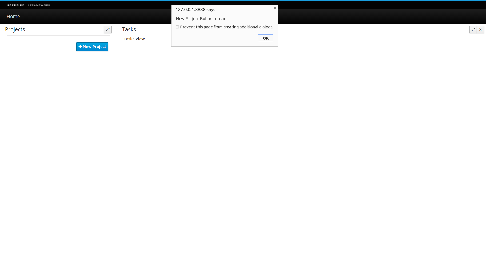

##UFTasks Application

We will be developing our UFTasks application in "baby steps", running and testing the app as each step is completed so you can see the effects of each coding exercise.

In the first version of our app, we will create two Screens, for Projects and Tasks, and one Perspective to hold these screens. We will then expand the app, adding a Dashboard and a new Perspective to display it.

As we progress we will introduce other Uberfire components, such as the Virtual File System, RPC services and a fully functional Editor. This will cover most of the available Uberfire components. We will also explore some of the less common GWT widgets, such as item lists, selection lists, text areas, date pickers, etc. and see how to integrate these into our application.

###The Model

Arguably, the most important design task when creating any application is defining the data structures and relationships
that represent the objects and concepts in the real world that we are trying to model.
Since even minor model changes can affect the entire application, it's important to get this right early in the design process.

For our UFTasks application, we want to be able to categorize our TO-DO list tasks by "Projects";
a Project in our case will simply have a descriptive name, for example "Household chores" or "My First Uberfire Application".
We also want to further organize our tasks by "Folders", which groups the Tasks by topics.
In our application, Folders have only a descriptive name.

From this design requirement, our model becomes evident: essentially we have a tree structure with Projects at the top, Folders as child nodes of Projects and Tasks as child nodes of Folders.

We will create all of our model classes in the org.uberfire.shared.model package in the uftasks-webapp project.

Let's use a generic class called **TreeNode** which we can extend for Projects, Folders and Tasks.

_TreeNode.java_
```
package org.uberfire.shared.model;

public class TreeNode<PARENT extends TreeNode, CHILD extends TreeNode> {
    private PARENT parent;
    private List<CHILD> children;

    public TreeNode() {
        parent = null;
    }

    public String getName() {
        return "noname";
    }

    public PARENT getParent() {
        return (PARENT) parent;
    }

    public void setParent(PARENT parent) {
        this.parent = parent;
    }

    public List<CHILD> getChildren() {
        if (children == null)
            children = new ArrayList<CHILD>();
        return children;
    }

    public void addChild(CHILD child) {
        getChildren().add(child);
        child.setParent(this);
    }
}
```

The generic type parameters **PARENT** and **CHILD** define the parent and child types of this node. This will make more sense when we look at the **Project** class:

_Project.java_
```
package org.uberfire.shared.model;

public class Project extends TreeNode<TasksRoot, Folder> {

    private final String name;
    private boolean selected;

    public Project(String name) {
        this.name = name;
        this.selected = false;
    }

    public String getName() {
        return name;
    }

    public boolean isSelected() {
        return selected;
    }

    public void setSelected(boolean selected) {
        this.selected = selected;
    }
}
```

A Project has a name and a "selected" flag indicating if it is currently the selected or "active" project. Here, the **PARENT** is a **TasksRoot** type, and the **CHILD** is a **Folder** type.

**TasksRoot** is the root of our tree and looks like this:

_TasksRoot.java_

```
package org.uberfire.shared.model;

public class TasksRoot extends TreeNode<TreeNode,Project>{
    
    public TasksRoot() {
    }
    
}
```

There's not much in here because all of the tree navigation functionality is in the **TreeNode** base class.
Note that since the root has no **PARENT** type, we will just use **TreeNode** as a place holder; its parent will be null.

The **Folder** node looks like this:

_Folder.java_
```
package org.uberfire.shared.model;

public class Folder extends TreeNode<Project, Task> {

    private final String name;

    public Folder(String name) {
        this.name = name;
    }

    public String getName() {
        return name;
    }
}
```

As expected, the **PARENT** is a **Project** and the **CHILD** is a **Task** type.

Finally, the **Task** class:

_Task.java_
```
package org.uberfire.shared.model;

public class Task extends TreeNode<Folder, TreeNode> {
    private String name;
    private boolean done;

    public Task(String name) {
        this.name = name;
        this.done = false;
    }
    
    public String getName() {
        return name;
    }

    public void setName(String name) {
        this.name = name;
    }
    
    public boolean isDone() {
        return done;
    }

    public void setDone(boolean done) {
        this.done = done;
    }
}
```

Again, no surprises here except this is a "leaf" node in the tree so it has no children and we'll use **TreeNode** as the **CHILD** type parameter.

###Creating the Projects Screen

Following the MVP pattern, each Uberfire Screen will be a Presenter plus a View. Our views will be built using [Errai UI](https://docs.jboss.org/author/display/ERRAI/Errai+UI). This means we will also have an HTML file associated with each Screen.

In the package org.uberfire.client.screens, create this file:

_ProjectsPresenter.java_
```
package org.uberfire.client.screens;

import org.uberfire.client.annotations.WorkbenchPartTitle;
import org.uberfire.client.annotations.WorkbenchPartView;
import org.uberfire.client.annotations.WorkbenchScreen;
import org.uberfire.client.mvp.UberView;

import javax.enterprise.context.ApplicationScoped;
import javax.inject.Inject;

@ApplicationScoped
@WorkbenchScreen(identifier = "ProjectsPresenter")
public class ProjectsPresenter {

    public interface View extends UberView<ProjectsPresenter> {
    }

    @Inject
    private View view;

    @WorkbenchPartTitle
    public String getTitle() {
        return "Projects";
    }

    @WorkbenchPartView
    public UberView<ProjectsPresenter> getView() {
        return view;
    }
}
```
The presenter itself is a CDI bean with one injected field (the view). We have also introduced some new CDI annotations here:

- **@ApplicationScoped** indicates that this bean is a singleton; [more information can be found here](http://docs.oracle.com/javaee/6/api/javax/enterprise/context/ApplicationScoped.html).

- **@WorkbenchScreen**
Tells Uberfire that the class defines a Screen in the application. Each Screen has an identifier which is used by the **PlaceManager**, as we will discover later.

- **@WorkbenchPartTitle**
Denotes the method that returns the Screen’s title. Every Screen must have a **@WorkbenchPartTitle** method.

- **@WorkbenchPartView**
Denotes the method that returns the Panel’s view. The view can be any class that extends GWT’s **Widget** class or implements GWT’s **IsWidget** interface. In this example, we’re returning a CDI bean that implements **UberView<ProjectsPresenter>**, which is the specific view for this presenter (following MVP pattern). Every Screen must have a **@WorkbenchPartView** method.

Let's define our view, also in the org.uberfire.client.screens package:

_ProjectsView.java_
```
package org.uberfire.client.screens;

import javax.enterprise.context.Dependent;

import com.google.gwt.user.client.ui.Composite;
import org.jboss.errai.ui.shared.api.annotations.Templated;

@Dependent
@Templated
public class ProjectsView extends Composite implements ProjectsPresenter.View {

    private ProjectsPresenter presenter;

    @Override
    public void init( ProjectsPresenter presenter ) {
        this.presenter = presenter;
    }
}
```

Notice the **@Templated** annotation; this indicates that the View has an HTML file associated with it; this file must have the same name as its View, so let's create it:

_ProjectsView.html_
```
<div class="container-fluid">
    <label>Project View</label>
</div>
```
For now, this view only has a label with the text "Project View".

###Creating the Tasks Screen
Our second Screen is the Tasks Screen. Let's create our Screen components, also in the org.uberfire.client.screens package:

_TasksPresenter.java_
```
package org.uberfire.client.screens;

import org.uberfire.client.annotations.WorkbenchPartTitle;
import org.uberfire.client.annotations.WorkbenchPartView;
import org.uberfire.client.annotations.WorkbenchScreen;
import org.uberfire.client.mvp.UberView;

import javax.enterprise.context.ApplicationScoped;
import javax.inject.Inject;

@ApplicationScoped
@WorkbenchScreen(identifier = "TasksPresenter")
public class TasksPresenter {

    public interface View extends UberView<TasksPresenter> {
    }

    @Inject
    private View view;

    @WorkbenchPartTitle
    public String getTitle() {
        return "Tasks";
    }

    @WorkbenchPartView
    public UberView<TasksPresenter> getView() {
        return view;
    }
}
```

_TasksView.java_
```
package org.uberfire.client.screens;

import javax.enterprise.context.Dependent;

import com.google.gwt.user.client.ui.Composite;
import org.jboss.errai.ui.shared.api.annotations.Templated;

@Dependent
@Templated
public class TasksView extends Composite implements TasksPresenter.View {

    private TasksPresenter presenter;

    @Override
    public void init( final TasksPresenter presenter ) {
        this.presenter = presenter;
    }
}
```

_TasksView.html_
```
<div class="container-fluid">
    <label>Tasks View</label>
</div>
```

###Creating the Tasks Perspective
Now we have two Uberfire Screens, but nowhere to put them. Remember, the Uberfire Workbench UI is arranged as Workbench → Perspective → Workbench Panel → Screen. Perspectives dictate the position and size of Workbench Panels. Besides the explicit positioning approach, we can also define perspectives using Errai UI templates.

We need to define a Perspective class in org.uberfire.client.perspectives:

_TasksPerspective.java_
```
package org.uberfire.client.perspectives;

import javax.enterprise.context.ApplicationScoped;

import org.uberfire.client.annotations.Perspective;
import org.uberfire.client.annotations.WorkbenchPerspective;
import org.uberfire.client.workbench.panels.impl.MultiListWorkbenchPanelPresenter;
import org.uberfire.client.workbench.panels.impl.SimpleWorkbenchPanelPresenter;
import org.uberfire.mvp.impl.DefaultPlaceRequest;
import org.uberfire.workbench.model.CompassPosition;
import org.uberfire.workbench.model.PanelDefinition;
import org.uberfire.workbench.model.PerspectiveDefinition;
import org.uberfire.workbench.model.impl.PanelDefinitionImpl;
import org.uberfire.workbench.model.impl.PartDefinitionImpl;
import org.uberfire.workbench.model.impl.PerspectiveDefinitionImpl;

@ApplicationScoped
@WorkbenchPerspective(identifier = "TasksPerspective", isDefault = true)
public class TasksPerspective {

    @Perspective
    public PerspectiveDefinition buildPerspective() {
        final PerspectiveDefinitionImpl perspective =
                new PerspectiveDefinitionImpl( MultiListWorkbenchPanelPresenter.class.getName() );
        perspective.setName( "TasksPerspective" );

        final PanelDefinition west = new PanelDefinitionImpl( SimpleWorkbenchPanelPresenter.class.getName() );
        west.addPart( new PartDefinitionImpl( new DefaultPlaceRequest( "ProjectsPresenter" ) ) );
        west.setWidth( 350 );
        perspective.getRoot().insertChild( CompassPosition.WEST, west );

        perspective.getRoot().addPart( new PartDefinitionImpl( new DefaultPlaceRequest( "TasksPresenter" ) ) );

        return perspective;
    }
}
```
Once again, we’re encountering some new annotations:

- **@WorkbenchPerspective**
tells UberFire that the class defines a perspective.

- **@Perspective**
tells Uberfire that this method returns the **PerspectiveDefinition** that governs the perspective’s layout and default contents. Every **@WorkbenchPerspective** class needs a method annotated with **@Perspective**.

In this definition, we’ll add a new panel on the left-hand side (WEST) and populate it with **ProjectsPresenter** by default. The perspective root panel (main window) will be populated with **TasksPresenter**.


###Modifying the Application Entry Point

Inside the package org.uberfire.client, modify the setup method as follows to create a menu item in the "TaskPerspective" we just defined before (instead of the **MainPerspective**):

_ShowcaseEntryPoint.java_
```
private void setupMenu( @Observes final ApplicationReadyEvent event ) {
    final Menus menus =
            newTopLevelMenu( "Home" )
                    .respondsWith( new Command() {
                        @Override
                        public void execute() {
                            placeManager.goTo( new DefaultPlaceRequest( "TasksPerspective" ) );
                        }
                    } )
                    .endMenu()
                    .build();

    menubar.addMenus( menus );
}
```


###Time to see it work!
We’ve come a long way since we started with that empty directory. Let’s reward all your hard work by starting the app and seeing it do something!

If you are using a IDE, stop the server, build and restart. If you are using a command line interface (shell) enter the maven build commands:

```
$ mvn clean install
$ mvn clean gwt:run
```

Eventually, the GWT Development Mode GUI will pop up. Wait for the "Calculating…" button to change to "Launch in Default Browser," then press that button.

This should be the result of your work:


And the app running:


###Expanding the Projects Screen
Now that we have the basic infrastructure required for our project, it's time to put some functionality in the Projects Screen. Let's begin with the **ProjectsPresenter**.

####ProjectsPresenter
```
package org.uberfire.client.screens;

import javax.enterprise.context.ApplicationScoped;
import javax.inject.Inject;

import org.uberfire.client.annotations.WorkbenchPartTitle;
import org.uberfire.client.annotations.WorkbenchPartView;
import org.uberfire.client.annotations.WorkbenchScreen;
import org.uberfire.client.mvp.UberView;
import org.uberfire.component.model.Project;

@ApplicationScoped
@WorkbenchScreen(identifier = "ProjectsPresenter")
public class ProjectsPresenter {

    public interface View extends UberView<ProjectsPresenter> {

        void clearProjects();

        void addProject(Project project, boolean selected);
    }

    @Inject
    private View view;

    @WorkbenchPartTitle
    public String getTitle() {
        return "Projects";
    }

    @WorkbenchPartView
    public UberView<ProjectsPresenter> getView() {
        return view;
    }

    public void newProject() {
        Window.alert( "New Project Button clicked!" );
    }

    public void selectProject(Project project) {
        // TODO
    }
}
```

We have added two new methods to our View: **clearProjects()** and **addProject()**. Their function will become evident shortly.

####ProjectsView
Our view has two UI widgets: a [Bootstrap3](https://gwtbootstrap3.github.io/gwtbootstrap3-demo/#listGroup) LinkedGroup to list our projects and a button to create new ones.

Here’s what _ProjectsView.html_ looks like now:
```
<div>
    <div class="list-group" id="projects"></div>
    <button type="button" class="btn btn-primary" id="new-project"
            style="float: right; margin-right: 5px;">
        <i class="fa fa-plus"></i> New Project
    </button>
</div>
```
And our java class now looks like this:
```
package org.uberfire.client.screens;

import javax.enterprise.context.Dependent;
import javax.inject.Inject;

import com.google.gwt.core.client.GWT;
import com.google.gwt.event.dom.client.ClickEvent;
import com.google.gwt.user.client.ui.Composite;
import org.gwtbootstrap3.client.ui.Button;
import org.gwtbootstrap3.client.ui.LinkedGroup;
import org.gwtbootstrap3.client.ui.LinkedGroupItem;
import org.jboss.errai.ui.shared.api.annotations.DataField;
import org.jboss.errai.ui.shared.api.annotations.EventHandler;
import org.jboss.errai.ui.shared.api.annotations.Templated;

@Dependent
@Templated
public class ProjectsView extends Composite implements ProjectsPresenter.View {

    private ProjectsPresenter presenter;

    @Inject
    @DataField("new-project")
    Button newProject;

    @Inject
    @DataField("projects")
    LinkedGroup projectsGroup;

    @Override
    public void init( ProjectsPresenter presenter ) {
        this.presenter = presenter;
    }

    @Override
    public void clearProjects() {
        projectsGroup.clear();
    }

    @Override
    public void addProject(final Project project, final boolean active) {
	    // TODO
    }

    @EventHandler("new-project")
    public void newProject( ClickEvent event ) {
        presenter.newProject();
    }
}
```

The two **@DataField** attributes bind the template elements with the view Java class by their element IDs. The **<div>** element with id="projects" declares a class attribute that identifies a special GWT list component we will use to display our Projects list.

The **@EventHandler** method is a click handler for the "New Project" button. When the button is clicked, it passes the event on to the Presenter by calling its **newProject()** method.

###Time to see it work!
Refresh the browser, let GWT Super Dev mode do its magic. When the New Project button is clicked, we should see our alert dialog:



###New Project Popup
The next step of our project is to provide a real implementation for the New Project button. We will use a popup modal dialog to achieve this; create these classes in org.uberfire.client.screens.popup package:

_NewProjectPresenter.java_
```
package org.uberfire.client.screens.popup;

import javax.annotation.PostConstruct;
import javax.enterprise.context.Dependent;
import javax.inject.Inject;

import org.uberfire.client.mvp.UberView;
import org.uberfire.client.screens.ProjectsPresenter;

@Dependent
public class NewProjectPresenter {

    private ProjectsPresenter projectsPresenter;

    public interface View extends UberView<NewProjectPresenter> {

        void show();

        void hide();
    }

    @Inject
    private View view;

    @PostConstruct
    public void setup() {
        view.init( this );
    }

    public void show( ProjectsPresenter projectsPresenter ) {
        this.projectsPresenter = projectsPresenter;
        view.show();
    }

    public void newProject( String projectName ) {
        projectsPresenter.createNewProject( projectName );
        view.hide();
    }

    public void close() {
        view.hide();
    }
}
```
The method **show(projectsPresenter)** will call the NewProjectView to create and show a modal popup dialog. The **newProject(projectName)** method will call the ProjectsPresenter to create the new project, and then hide the popup.

Here is the HTML template we'll use with the View:

_NewProjectView.html_
```
<div>
    <form data-field="new-project-modal">
        <fieldset>
            <legend>New Project</legend>
            <div class="form-group">
                <label class="control-label col-md-3">Name</label>
                <div class="col-md-9">
                    <input type="text" class="form-control" data-field="project-name"
                           placeholder="Project name">
                    <span data-field="project-name-help" class="help-block"></span>
                </div>
            </div>
        </fieldset>
    </form>
    <div class="modal-footer">
        <button type="button" class="btn btn-danger" data-field="cancel-button">Cancel</button>
        <button type="button" class="btn btn-primary" data-field="ok-button">OK</button>
    </div>
</div>
```

An here is the View class that manages the modal popup dialog:

_NewProjectView.java_
```
package org.uberfire.client.screens.popup;

import javax.enterprise.context.Dependent;
import javax.inject.Inject;

import com.google.gwt.event.dom.client.ClickEvent;
import com.google.gwt.user.client.ui.Composite;
import org.gwtbootstrap3.client.ui.Button;
import org.gwtbootstrap3.client.ui.Modal;
import org.gwtbootstrap3.client.ui.ModalBody;
import org.gwtbootstrap3.client.ui.TextBox;
import org.jboss.errai.ui.shared.api.annotations.DataField;
import org.jboss.errai.ui.shared.api.annotations.EventHandler;
import org.jboss.errai.ui.shared.api.annotations.Templated;

@Dependent
@Templated
public class NewProjectView extends Composite implements NewProjectPresenter.View {

    private NewProjectPresenter presenter;

    private Modal modal;

    @Inject
    @DataField("project-name")
    TextBox projectNameTextBox;

    @Inject
    @DataField("ok-button")
    Button okButton;

    @Inject
    @DataField("cancel-button")
    Button cancelButton;

    @Override
    public void init( NewProjectPresenter presenter ) {
        this.presenter = presenter;

        this.modal = new Modal();
        final ModalBody body = new ModalBody();
        body.add( this );
        modal.add( body );
    }

    @Override
    public void show() {
        modal.show();
    }

    @Override
    public void hide() {
        modal.hide();
        projectNameTextBox.setText( "" );
    }

    @EventHandler("ok-button")
    public void addProject( ClickEvent event ) {
        presenter.newProject( projectNameTextBox.getText() );
    }

    @EventHandler("cancel-button")
    public void cancel( ClickEvent event ) {
        presenter.close();
    }
}
```

Again, we have **@Inject**ed some elements from our HTML template: a TextBox used to enter the project name, and "OK" and "Cancel" buttons to save and dismiss the popup.

Now we have to change _ProjectsPresenter.java_ in order to open the popup and receive the name of the new project created. Add this snippet to your class:

_ProjectsPresenter.java_
```
import com.google.gwt.user.client.Window;
import org.uberfire.client.screens.popup.NewProjectPresenter;

[...]

    @Inject
    private NewProjectPresenter newProjectPresenter;

    public void newProject() {
        newProjectPresenter.show( this );
    }

    public void createNewProject( String projectName ) {
        Window.alert( "project created: " + projectName );
    }
```

###Time to see it work!
Let’s see the results of all our hard work: start the app and watch it open the popup dialog displaying the project created message!

Refresh your browser and click on the New Project button.


###Adding a Project to the List

Our next task is to implement the **createNewProject(projectName)** method in ProjectsPresenter.
Add the following code to your Presenter class:

_ProjectsPresenter.java_
```
import org.uberfire.component.model.Project;
import org.uberfire.component.model.TasksRoot;

[...]

    private TasksRoot tasksRoot = new TasksRoot();

    public void createNewProject(String projectName) {
        tasksRoot.getChildren().add(new Project(projectName));
        updateView();
    }

    private void updateView() {
        view.clearProjects();
        for (Project project : tasksRoot.getChildren()) {
            view.addProject(project, project.isSelected());
        }
    }
```

We will also need to implement our View's **addProject(project, selected)** method:

_ProjectsView.java_
```
import org.gwtbootstrap3.client.ui.LinkedGroup;
import org.gwtbootstrap3.client.ui.LinkedGroupItem;

[...]

    public class ProjectItem extends LinkedGroupItem {
        Project project;

        public ProjectItem(Project project) {
            this.project = project;
            setText(project.getName());
        }

        public Project getProject() {
            return project;
        }
    }


    @Override
    public void addProject(final Project project, final boolean active) {
        final LinkedGroupItem projectItem = createProjectItem(project, active);
        projectsGroup.add(projectItem);
    }

    private ProjectItem createProjectItem(final Project project, final boolean active) {
        final ProjectItem projectItem = new ProjectItem(project);
        projectItem.setActive(active);
        projectItem.addClickHandler((event) -> presenter.selectProject(projectItem.getProject()));
        return projectItem;
    }
```

Here we have defined an inner class called **ProjectItem** which simply wraps a Project model object within a GWT LinkedGroupItem element.
This element can then be added to our Projects LinkedGroup list.

###Time to see it work!

Refresh the browser, and add two projects to the list; it should look something like this:


###Creating the Tasks List
When our user creates or selects a project in the projects list, we need to display the Folders and Tasks associated with that Project.

In order to do that, let's create a model class called ProjectSelectedEvent, to allow communication between our screens:

_ProjectSelectedEvent.java_
```
package org.uberfire.shared.events;

public class ProjectSelectedEvent {

    private final Project project;

    public ProjectSelectedEvent(Project project) {
        this.project = project;
    }

    public Project getProject() {
        return project;
    }
}
```

And also add this code to _ProjectsPresenter.java_:
```
import org.uberfire.shared.events.ProjectSelectedEvent;
import javax.enterprise.event.Event;

[...]

    @Inject
    private Event<ProjectSelectedEvent> projectSelectedEvent;

    public void selectProject(Project project) {
        setActiveProject(project);
        projectSelectedEvent.fire(new ProjectSelectedEvent(project));
    }

    private void setActiveProject(Project project) {
        activeProject = project;
        for (Project p : tasksRoot.getChildren()) {
            if (p == project) {
                p.setSelected(true);
            }
            else {
                p.setSelected(false);
            }
        }
        updateView();
    }
```
There are two important calls that happen inside the **selectProject(project)** method:

- setActiveProject(project): marks a specific project as active and updates the view
- projectSelectEvent.fire(...): fires a CDI event telling **TasksPresenter** that a project was selected

Now, let's listen to this CDI event in _TasksPresenter.java_. Add the following method:
```
import com.google.gwt.user.client.Window;
import org.uberfire.shared.events.ProjectSelectedEvent;
import javax.enterprise.event.Observes;

[...]

    public void projectSelected( @Observes ProjectSelectedEvent projectSelectedEvent ) {
        Window.alert( projectSelectedEvent.getName() );
    }
```

The **@Observes** annotation tells the framework to notify this bean, by way of this method, whenever a ProjectSelectedEvent is fired from anywhere.

###Time to see it work!

Refresh the browser, create two projects and click on one of them.


###Creating a New folder
Our next step is to create a "New Folder" button. A Folder is an aggregator of Tasks. This button is only displayed after a project is selected. Let's edit the view:

_TasksView.html_
```
<div>
    <div class="list-group" data-field="tasks"></div>
    <button type="button" class="btn btn-primary" data-field="new-folder">
        <i class="fa fa-plus"></i> New Folder
    </button>
</div>
```
Update your _TasksPresenter.java_ with the following code:
```
import org.uberfire.client.screens.popup.NewFolderPresenter;
import org.uberfire.shared.model.Folder;
import org.uberfire.shared.model.Project;
import org.uberfire.shared.events.ProjectSelectedEvent;

[...]

    public interface View extends UberView<TasksPresenter> {

        void activateNewFolder();

        void clearTasks();

        void newFolder(Folder folder);
    }

    @Inject
    private NewFolderPresenter newFolderPresenter;

    private Project currentSelectedProject;

    public void projectSelected( @Observes ProjectSelectedEvent projectSelectedEvent ) {
        this.currentSelectedProject = projectSelectedEvent.getName();
        selectFolder();
    }

    private void selectFolder() {
        view.activateNewFolder();
        updateView();
    }

    public void showNewFolder() {
        newFolderPresenter.show( this );
    }

    private void updateView() {
        view.clearTasks();
        for (final Folder folder : getFolders()) {
            view.newFolder(folder);
        }
    }

    public void newFolder( String folderName ) {
        updateView();
    }
}
```
We're going to use a popup dialog, just as we did with the "New Project" feature. Let's create it in the org.uberfire.client.screens.popup package:

_NewFolderPresenter.java_
```
package org.uberfire.client.screens.popup;

import javax.annotation.PostConstruct;
import javax.enterprise.context.Dependent;
import javax.inject.Inject;

import org.uberfire.client.mvp.UberView;
import org.uberfire.client.screens.TasksPresenter;

@Dependent
public class NewFolderPresenter {

    public interface View extends UberView<NewFolderPresenter> {

        void show();

        void hide();
    }

    @Inject
    private View view;

    private TasksPresenter tasksPresenter;

    @PostConstruct
    public void setup() {
        view.init( this );
    }

    public void show( TasksPresenter tasksPresenter ) {
        this.tasksPresenter = tasksPresenter;
        view.show();
    }

    public void newFolder( String folderName ) {
        tasksPresenter.newFolder( folderName );
        view.hide();
    }

    public void close() {
        view.hide();
    }
}
```
_NewFolderView.java_
```
package org.uberfire.client.screens.popup;

import javax.enterprise.context.Dependent;
import javax.inject.Inject;

import com.google.gwt.event.dom.client.ClickEvent;
import com.google.gwt.user.client.ui.Composite;
import org.gwtbootstrap3.client.ui.Button;
import org.gwtbootstrap3.client.ui.Modal;
import org.gwtbootstrap3.client.ui.ModalBody;
import org.gwtbootstrap3.client.ui.TextBox;
import org.jboss.errai.ui.shared.api.annotations.DataField;
import org.jboss.errai.ui.shared.api.annotations.EventHandler;
import org.jboss.errai.ui.shared.api.annotations.Templated;

@Dependent
@Templated
public class NewFolderView extends Composite
        implements NewFolderPresenter.View {

    private NewFolderPresenter presenter;

    private Modal modal;

    @Inject
    @DataField("folder-name")
    TextBox folderNameTextBox;

    @Inject
    @DataField("ok-button")
    Button okButton;

    @Inject
    @DataField("cancel-button")
    Button cancelButton;

    @Override
    public void init( NewFolderPresenter presenter ) {
        this.presenter = presenter;

        this.modal = new Modal();
        final ModalBody body = new ModalBody();
        body.add( this );
        modal.add( body );
    }

    @Override
    public void show() {
        modal.show();
    }

    @Override
    public void hide() {
        modal.hide();
        folderNameTextBox.setText( "" );
    }

    @EventHandler("ok-button")
    public void addFolder( ClickEvent event ) {
        presenter.newFolder( folderNameTextBox.getText() );
    }

    @EventHandler("cancel-button")
    public void cancel( ClickEvent event ) {
        presenter.close();
    }
}
```
_NewFolderView.html_
```
<div>
    <form data-field="new-folder-modal">
        <fieldset>
            <legend>New Folder</legend>
            <div class="form-group">
                <label class="control-label col-md-3">Name</label>
                <div class="col-md-9">
                    <input type="text" class="form-control" data-field="folder-name"
                           placeholder="Folder name">
                    <span data-field="project-name-help" class="help-block"></span>
                </div>
            </div>
        </fieldset>
    </form>
    <div class="modal-footer">
        <button type="button" class="btn btn-danger" data-field="cancel-button">Cancel</button>
        <button type="button" class="btn btn-primary" data-field="ok-button">OK</button>
    </div>
</div>
```

Feel free to rebuild and test this code. It should work the same way as the "New Project" function.

###Adding Tasks
It's time to add some tasks to our project. At this point, you're probably very comfortable with basic Uberfire concepts, so we'll just quickly run through the necessary changes to implement the tasks support in our project.
``
Here is the completed _TasksPresenter.java_ class in its entirety:
```
package org.uberfire.client.screens;

import java.util.List;

import javax.enterprise.context.ApplicationScoped;
import javax.enterprise.event.Event;
import javax.enterprise.event.Observes;
import javax.inject.Inject;

import org.uberfire.client.annotations.WorkbenchPartTitle;
import org.uberfire.client.annotations.WorkbenchPartView;
import org.uberfire.client.annotations.WorkbenchScreen;
import org.uberfire.client.mvp.UberView;
import org.uberfire.client.screens.popup.NewFolderPresenter;
import org.uberfire.shared.events.FolderCreatedEvent;
import org.uberfire.shared.events.ProjectSelectedEvent;
import org.uberfire.shared.events.TaskCreatedEvent;
import org.uberfire.shared.events.TaskDoneEvent;
import org.uberfire.shared.model.Folder;
import org.uberfire.shared.model.Project;
import org.uberfire.shared.model.Task;

@ApplicationScoped
@WorkbenchScreen(identifier = "TasksPresenter")
public class TasksPresenter {

    public interface View extends UberView<TasksPresenter> {

        void activateNewFolder();

        void clearTasks();

        void newFolder(Folder folder);
    }

    @Inject
    private View view;

    @Inject
    private NewFolderPresenter newFolderPresenter;

    @Inject
    private Event<TaskCreatedEvent> taskCreatedEvent;

    @Inject
    private Event<TaskDoneEvent> taskDoneEvent;
    
    @Inject
    private Event<FolderCreatedEvent> folderCreatedEvent;

    private Project currentSelectedProject;

    @WorkbenchPartTitle
    public String getTitle() {
        return "Tasks";
    }

    @WorkbenchPartView
    public UberView<TasksPresenter> getView() {
        return view;
    }

    public void projectSelected(@Observes ProjectSelectedEvent projectSelectedEvent) {
        currentSelectedProject = projectSelectedEvent.getProject();
        selectFolder();
    }

    private void selectFolder() {
        view.activateNewFolder();
        updateView();
    }

    public void showNewFolder() {
        newFolderPresenter.show(this);
    }

    private List<Folder> getFolders() {
        return currentSelectedProject.getChildren();
    }

    private void updateView() {
        view.clearTasks();
        for (final Folder folder : getFolders()) {
            view.newFolder(folder);
        }
    }

    public void newFolder(String folderName) {
        folderCreatedEvent.fire(new FolderCreatedEvent(new Folder(folderName)));
        updateView();
    }
    
    public void doneTask(Task task) {
        taskDoneEvent.fire(new TaskDoneEvent(task.getParent(), task));
        updateView();
    }

    public void createTask(Folder folder, Task task) {
        taskCreatedEvent.fire(new TaskCreatedEvent(folder, task));
        updateView();
    }
}
```
Here are some things to take note of:

- **TaskCreatedEvent** is fired when the user creates a new task by entering a name in the "New Task" text box. This event is caught by the **ProjectsPresenter** which constructs a new **Task** object and adds it to the model hierarchy.
- **FolderCreatedEvent** is handled similarly; **ProjectsPresenter** catches the event, creates a new **Folder** object and adds it to the model.
- **TaskDoneEvent** is fired when the user clicks the checkbox next to the task name. Again, this event is handled by **ProjectsPresenter**, which sets the "done" flag in the **Task** object.

We could have simply handled each of these events straight away in the **TasksPresenter**, but for reasons which will become obvious later, we chose to pass these on to a single point of contact - the **ProjectsPresenter**.

_TasksView.java_
```
package org.uberfire.client.screens;

import java.util.List;

import javax.enterprise.context.Dependent;
import javax.inject.Inject;

import org.gwtbootstrap3.client.ui.Badge;
import org.gwtbootstrap3.client.ui.Button;
import org.gwtbootstrap3.client.ui.InlineCheckBox;
import org.gwtbootstrap3.client.ui.InputGroup;
import org.gwtbootstrap3.client.ui.ListGroup;
import org.gwtbootstrap3.client.ui.ListGroupItem;
import org.gwtbootstrap3.client.ui.TextBox;
import org.gwtbootstrap3.client.ui.constants.ListGroupItemType;
import org.jboss.errai.ui.shared.api.annotations.DataField;
import org.jboss.errai.ui.shared.api.annotations.EventHandler;
import org.jboss.errai.ui.shared.api.annotations.Templated;
import org.uberfire.shared.model.Folder;
import org.uberfire.shared.model.Task;

import com.google.gwt.core.client.GWT;
import com.google.gwt.event.dom.client.ClickEvent;
import com.google.gwt.event.dom.client.KeyCodes;
import com.google.gwt.user.client.ui.Composite;
import com.google.gwt.user.client.ui.FlowPanel;

@Dependent
@Templated
public class TasksView extends Composite implements TasksPresenter.View {

    private TasksPresenter presenter;

    @Inject
    @DataField("new-folder")
    Button newFolderButton;

    @Inject
    @DataField("tasks")
    FlowPanel taskPanel;

    public class TaskItem extends ListGroupItem {
        private Task task;

        public TaskItem(Task task) {
            this.task = task;
        }

        public Task getTask() {
            return task;
        }
    }

    @Override
    public void init(final TasksPresenter presenter) {
        this.presenter = presenter;
        this.newFolderButton.setVisible(false);
    }

    @Override
    public void activateNewFolder() {
        newFolderButton.setVisible(true);
    }

    @Override
    public void clearTasks() {
        taskPanel.clear();
    }

    @Override
    public void newFolder(Folder folder) {

        ListGroup folderGroup = GWT.create(ListGroup.class);
        List<Task> taskList = folder.getChildren();
        folderGroup.add(generateFolderTitle(folder.getName(), taskList.size()));
        for (Task task : taskList) {
            folderGroup.add(generateTask(task));
        }
        folderGroup.add(generateNewTask(folder));

        taskPanel.add(folderGroup);
    }

    private ListGroupItem generateNewTask(Folder folder) {
        ListGroupItem newTask = GWT.create(ListGroupItem.class);

        InputGroup inputGroup = GWT.create(InputGroup.class);
        inputGroup.add(createTextBox(folder));

        newTask.add(inputGroup);

        return newTask;
    }

    private TextBox createTextBox(final Folder folder) {
        final TextBox taskText = GWT.create(TextBox.class);
        taskText.setWidth("400");
        taskText.setPlaceholder("New task...");
        taskText.addKeyDownHandler(event -> {
            if (event.getNativeKeyCode() == KeyCodes.KEY_ENTER) {
                Task task = new Task(taskText.getText());
                presenter.createTask(folder, task);
            }
        });

        return taskText;
    }

    private ListGroupItem generateFolderTitle(String name, Integer numberOfTasks) {
        ListGroupItem folderTitle = GWT.create(ListGroupItem.class);
        folderTitle.setText(name);
        folderTitle.setType(ListGroupItemType.INFO);

        Badge number = GWT.create(Badge.class);
        number.setText(String.valueOf(numberOfTasks));

        folderTitle.add(number);

        return folderTitle;
    }

    private ListGroupItem generateTask(Task task) {
        TaskItem tasks = new TaskItem(task);
        tasks.add(createTaskCheckbox(task));

        return tasks;
    }

    private InlineCheckBox createTaskCheckbox(Task task) {
        InlineCheckBox checkBox = GWT.create(InlineCheckBox.class);
        checkBox.setText(task.getName());
        checkBox.addClickHandler(event -> presenter.doneTask(task));
        checkBox.setValue(task.isDone());

        return checkBox;
    }

    @EventHandler("new-folder")
    public void newFolderClick(ClickEvent event) {
        presenter.showNewFolder();
    }
}
```

Pay attention to the method **newFolder(folder)**, because here is where we create the components for the task folder: a folderTitle, a list of tasks and newTask textbox.

###Time to see it work!

Refresh the browser, create two projects and click in one of them. Create a new folder and add some tasks for it.


###Adding a Dashboard

In order to get in touch with some important Uberfire concepts like adding more Perspectives, using PlaceManagers, etc, let's improve your tasks app and build a basic dashboard on it.

This dashboard will count the number of tasks created and done by project and will look like this:


Because we'll be writing new perspectives and screens, Uberfire needs to generate some new code; stop the server and let's get back to work.

####Dashboard Perspective
Create this class in the org.uberfire.client.perspectives package:

```
package org.uberfire.client.perspectives;

import org.uberfire.client.annotations.Perspective;
import org.uberfire.client.annotations.WorkbenchPerspective;
import org.uberfire.client.workbench.panels.impl.MultiListWorkbenchPanelPresenter;
import org.uberfire.mvp.impl.DefaultPlaceRequest;
import org.uberfire.workbench.model.PerspectiveDefinition;
import org.uberfire.workbench.model.impl.PartDefinitionImpl;
import org.uberfire.workbench.model.impl.PerspectiveDefinitionImpl;

import javax.enterprise.context.ApplicationScoped;

@ApplicationScoped
@WorkbenchPerspective(identifier = "DashboardPerspective")
public class DashboardPerspective {

    @Perspective
    public PerspectiveDefinition buildPerspective() {
        final PerspectiveDefinitionImpl perspective =
                new PerspectiveDefinitionImpl( MultiListWorkbenchPanelPresenter.class.getName() );
        perspective.setName( "DashboardPerspective" );

        perspective.getRoot().addPart( new PartDefinitionImpl( new DefaultPlaceRequest( "DashboardPresenter" ) ));

        return perspective;
    }
}
```
This class has one presenter (DashboardPresenter) and note that it is a little bit different from TaskPerspective, because it is not a default perspective. You can have only one default perspective that will be automatically loaded on startup.

####Dashboard Presenter
In org.uberfire.client.screens package:

```
package org.uberfire.client.screens;

import javax.enterprise.context.ApplicationScoped;
import javax.inject.Inject;

import org.uberfire.client.annotations.WorkbenchPartTitle;
import org.uberfire.client.annotations.WorkbenchPartView;
import org.uberfire.client.annotations.WorkbenchScreen;
import org.uberfire.client.mvp.UberView;
import org.uberfire.lifecycle.OnOpen;
import org.uberfire.shared.model.Project;
import org.uberfire.shared.model.TasksRoot;

import javax.inject.Named;

@ApplicationScoped
@WorkbenchScreen(identifier = "DashboardPresenter")
public class DashboardPresenter {

    public interface View extends UberView<DashboardPresenter> {

        void addProject(Project project, String tasksCreated, String tasksDone);

        void clear();
    }

    @Inject
    private View view;

    @Inject
    @Named("tasksRoot")
    private TasksRoot tasksRoot;

    @WorkbenchPartTitle
    public String getTitle() {
        return "Dashboard";
    }

    @WorkbenchPartView
    public UberView<DashboardPresenter> getView() {
        return view;
    }

    @OnOpen
    public void onOpen() {
        updateView();
    }

    private void updateView() {
        view.clear();
        for (Project project : tasksRoot.getProjects()) {
            int done = project.countDoneTasks();
            int notDone = project.countTotalTasks() - done;
            view.addProject(project, notDone+"", done+"");
        }
    }
}
```

####Dashboard View
Now it's time to create our view classes (org.uberfire.client.screens package):

_DashboardView.java_
```
package org.uberfire.client.screens;

import javax.enterprise.context.Dependent;
import javax.inject.Inject;

import com.google.gwt.core.client.GWT;
import com.google.gwt.user.client.ui.Composite;
import com.google.gwt.user.client.ui.FlowPanel;
import org.gwtbootstrap3.client.ui.Badge;
import org.gwtbootstrap3.client.ui.ListGroup;
import org.gwtbootstrap3.client.ui.ListGroupItem;
import org.gwtbootstrap3.client.ui.constants.ListGroupItemType;
import org.jboss.errai.ui.shared.api.annotations.DataField;
import org.jboss.errai.ui.shared.api.annotations.Templated;

@Dependent
@Templated
public class DashboardView extends Composite implements DashboardPresenter.View {

    private DashboardPresenter presenter;

    @Inject
    @DataField("projects")
    FlowPanel projects;

    @Override
    public void init( DashboardPresenter presenter ) {
        this.presenter = presenter;
    }

    @Override
    public void addProject( final String project,
                            final String tasksCreated,
                            final String tasksDone ) {
        ListGroup projectGroup = GWT.create( ListGroup.class );

        projectGroup.add( createListGroupItem( ListGroupItemType.INFO, project.toUpperCase(), null ) );
        projectGroup.add( createListGroupItem( ListGroupItemType.WARNING, "TODO", String.valueOf( tasksCreated ) ) );
        projectGroup.add( createListGroupItem( ListGroupItemType.SUCCESS, "DONE", String.valueOf( tasksDone ) ) );

        projects.add( projectGroup );
    }

    @Override
    public void clear() {
        projects.clear();
    }

    private ListGroupItem createListGroupItem( final ListGroupItemType type,
                                               final String text,
                                               final String number ) {
        ListGroupItem item = GWT.create( ListGroupItem.class );

        item.setType( type );
        item.setText( text );
        if ( number != null ) {
            Badge numberBadge = GWT.create( Badge.class );
            numberBadge.setText( number );
            item.add( numberBadge );
        }

        return item;
    }
}
```
_DashboardView.html_
```
<div class="list-group" data-field="projects"></div>
```

###Creating the Perspective Menu
Now it's time to put this work on our app menu. Open _ShowcaseEntryPoint.java_ and update the method **setupMenu(event)**:

```
    private void setupMenu( @Observes final ApplicationReadyEvent event ) {
        final Menus menus =
                newTopLevelMenu( "UF Tasks" )
                        .respondsWith(
                                () -> placeManager.goTo( new DefaultPlaceRequest( "TasksPerspective" ) ) )
                        .endMenu()
                        .newTopLevelMenu( "Dashboard" )
                        .respondsWith(
                                () -> placeManager.goTo( new DefaultPlaceRequest( "DashboardPerspective" ) ) )
                        .endMenu()
                        .build();

        menubar.addMenus( menus );
    }
```
Pay attention to placeManager.goTo( new DefaultPlaceRequest( "DashboardPerspective" ) ) call.
This method is a Workbench-centric abstraction over the browser's history mechanism. It allows the application to initiate navigation
to any displayable thing: a WorkbenchPerspective, a  WorkbenchScreen, a WorkbenchPopup, a WorkbenchEditor, a WorkbenchPart within a Screen or editor, or the editor associated with a VFS file.

###Time to see it work!

Start the server, refresh the browser, create two projects and click in one of them. Create a new folder and add some tasks for it and mark some of them as done. Click on Dashboard menu:


##What's Next?
While we did cover a lot of ground with this tutorial, we have only begun to scratch the surface of Uberfire. In Part 2 we will cover serialization of the model using Uberfire's VFS (Virtual File System) and we will show you how to decouple your model from client-side code using Errai's RPC services.

For now, we have a fully functioning web application that we can play with, so let's see how we can deploy it to a Tomcat and Wildfly app server.
