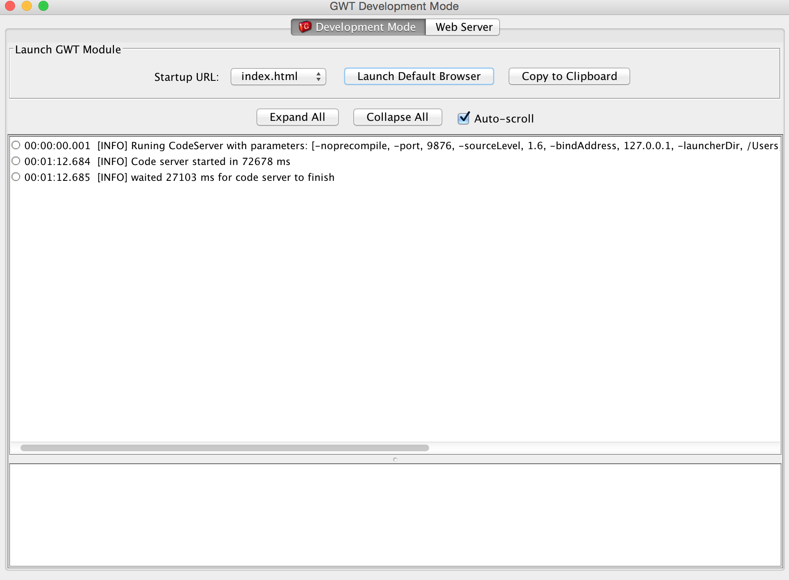
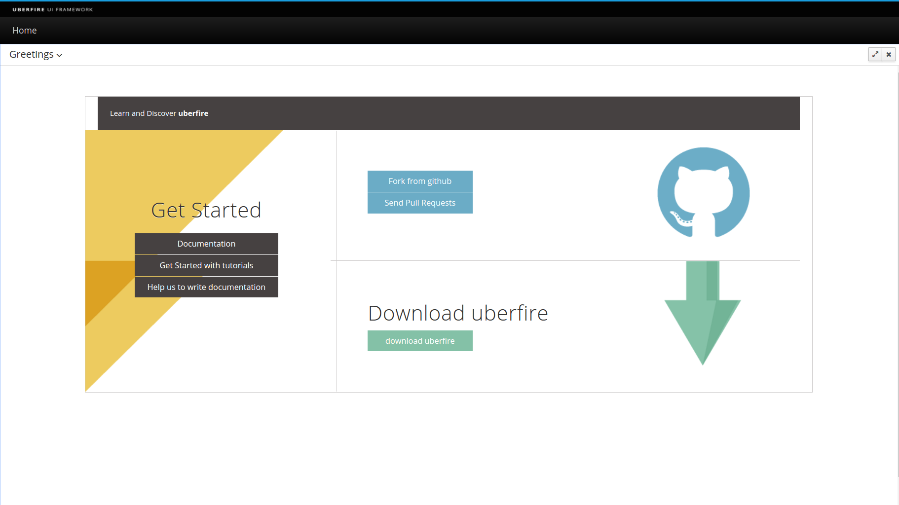

#Creating the UFTasks Project

Our UFTasks project will follow the standard Maven project layout, so let's create it using our archetype.

## Cloning Uberfire

First, let's clone the Uberfire repository, so we have the most recent archetype available.
From the command line, go into your preferred git directory and run one of the following commands:

HTTPS mode:
```
$ git clone https://github.com/uberfire/uberfire.git
```
or SSH mode:
```
$ git clone git@github.com:uberfire/uberfire.git
```

**Microsoft Windows Users:** Be sure to set the git core.longpaths configuration variable to "true". Some of Uberfire's file names are longer than 255 characters and the git shell will complain about "Filename too long" and simply skip over them.

## Building Uberfire

Now let's build Uberfire, and make our archetype available for use:
```
$ cd uberfire
$ mvn clean install -DskipTests=true -Dgwt.compiler.skip=true
```
This will create the archetype and store it in your ~/.m2 directory.

## Creating the UFTasks Project

 In a command line, go into your git directory and run this command to create your first app:

```
$ mvn archetype:generate -B \
-DarchetypeGroupId=org.uberfire \
-DarchetypeArtifactId=uberfire-project-archetype \
-DarchetypeVersion=0.9.0-SNAPSHOT \
-DgroupId=org.uberfire \
-DartifactId=uftasks \
-Dversion=1.0-SNAPSHOT\
-Dpackage=org.uberfire \
-DcapitalizedRootArtifactId=UFTasks
```

And then you should see a message like this:
```
[INFO] ---------------------------------------------------------
[INFO] BUILD SUCCESS
[INFO] ---------------------------------------------------------
[INFO] Total time: 3:32.347s
[INFO] Finished at: Wed Jan 14 20:30:27 BRST 2015
[INFO] Final Memory: 29M/959M
[INFO] ---------------------------------------------------------
```

## Building your App

To build your app, go to directory uftasks, build the project in maven and wait for the build to finish.

```
$ cd uftasks
$ mvn clean install
```
You should see the maven build success message again.

## See it work!

To run the application, enter the following:

```
$ cd uftasks-showcase/uftasks-webapp
$ mvn clean gwt:run
```

Wait for the GWT console to build your app:



Click on "Launch Default Browser" to open your Uberfire app. Log in with the username "admin" and the password "admin". After GWT has compiled your application, you should see the "Hello World" screen:



