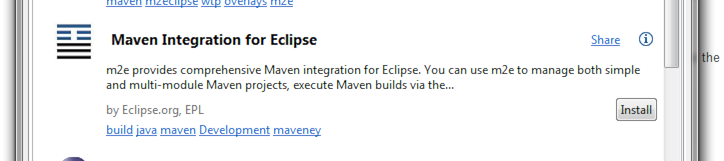
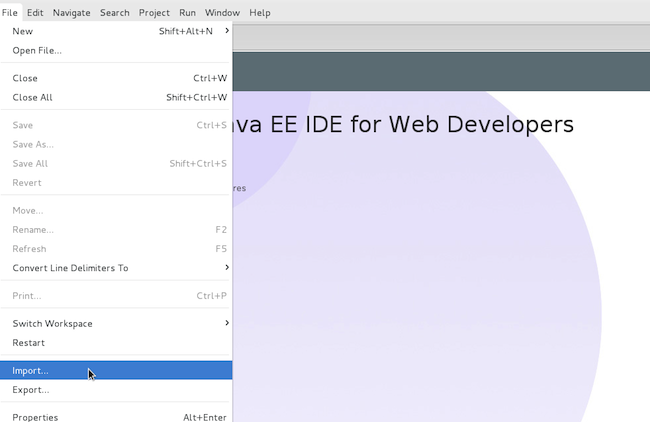
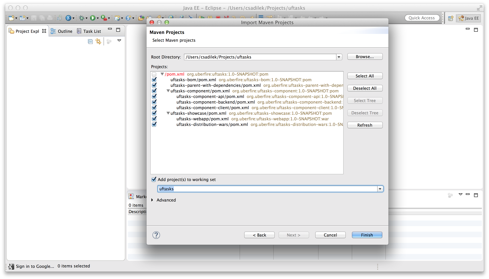

#Setup Dev Enviroment

Before we start building our project, it is important to set up a development environment.

To run  the web app, Uberfire uses Errai’s EmbeddedWildFlyLauncher, which provides an embedded WildFly instance within Dev Mode to allow users to debug server- and client-side code simultaneously in a single JVM.

This section will detail instructions for use with Eclipse and Intellij IDEA Ultimate Edition.

## Intellij IDEA

The Ultimate Edition for Intellij IDEA comes with a built-in GWT plugin that allows you to run and debug GWT apps. We can configure the plugin to use the embedded WildFly launcher to debug both server and client-side code in one debug session. This section explains how to do that.

(This procedure was tested on IntelliJ IDEA Ultimate 14.1.3 and 15.0.1)

1. Click on open, and point to pom.xml file located on uftasks dir. (Wait for import and indexing)

2. Access Run menu, select "Edit Configurations", press the + button under GWT Configurations to create a new GWT configuration.

3. Fill out the following parameters in the corresponding boxes:

**Name:** UFTasks

 **Module:** uftasks-webapp

 **Use Super Dev Mode**: yes (check it)

 **GWT Modules to load**: org.uberfire.FastCompiledUFTasksShowcase

(if your Gwt Modules are not displayed jin this combobox, go to FAQ section and look for "fix maven version on IDEA").

 **VM options**: -Xmx2048m -XX:MaxPermSize=512M -Derrai.jboss.home=/Users/ederign/projects/uftasks/uftasks-showcase/uftasks-webapp/target/wildfly-8.1.0.Final/

The errai.jboss.home parameter must point to your local WildFly installation directory or the Wildfly within the target/ directory of your app. For the UFTasks app, errai.jboss.home points to the WildFly installation within the target/ directory, which is redownloaded and installed as part of the build.

**Dev Mode Parameters**:
-server org.jboss.errai.cdi.server.gwt.EmbeddedWildFlyLauncher

**With JavaScript debugger**: optionally (you’ll need to install an IntelliJ plugin in your browser in order to have a better debug experience)

**Before Launch**: Add a new “Run Maven Goal” configuration **before** your make. Press + button, "Run Maven Goal"

Point “Working directory” to your webapp folder, Set “clean process-resources" in line parameter, press OK, and move this new configuration *before* Make.

This is what your config should look like:

To run or debug your app, select this configuration in the top right corner of Intellij IDEA and click the Run or Debug buttons next to it. Your app should start up in Dev Mode within Intellij automatically and you should be able to use Intellij’s own debugger to debug your code.

## Eclipse
This section will walk you through using Maven tooling for running and debugging your app within Eclipse. If you have not already installed m2e in Eclipse, you will want to do so now.

To install the Maven tooling, use the following steps:

1. Go to the Eclipse Marketplace under the Help menu in Eclipse.

2. In the Find dialog enter the phrase Maven and hit enter.

3. Find the Maven Integration for Eclipse plugin and click the Install button for that entry.

4. Accept the defaults by clicking Next , and then accept the User License Agreement to begin the installation.

### Import UFtasks Project

Once you have completed the installation of the prerequisites from the previous section, you will now be able to go ahead and import the Maven project you created in the first section of this guide.

Follow these steps to get the project setup:

1. From the File menu, select Import…

2. You will be presented with the Import dialog box. From here you want to select Maven → Existing Maven Projects

3. From the Import Maven Projects dialog, you will need to select the directory location of the project you created in the first section of this guide. In the Root Directory field of the dialog, enter the path to the project, or click Browse… to select it from the file chooser dialog.

4. Click Finish to begin the import process.
5. When the import process has finished, you should see your project imported within the Eclipse Project Explorer.

### Install additional Maven m2e connectors
You may find that Maven can not build some projects because of missing Maven plugins. These can be automatically installed by opening the pom.xml file and clicking the error message at the top of the Pom editor Overview page:

Click on **Discover new m2e connectors** and follow the prompts to find and install the missing connectors.

### Optional: disable Eclipse built-in Javascript validator

Some of the Javascript code generated by Uberfire does not conform to the ECMAScript 3 standard validator used by Eclipse which will cause Eclipse to report compilation errors. Rest assured, all the generated Javascript builds and runs and these errors will not affect execution of the app. To remove these errors, simply disable the built-in validator with the Javascript -> Validator User Preference setting:

### Running UFTasks with Eclipse

1. Next you will need to setup a Maven Run Profile for UF tasks. To do so select Run As… > Maven Build…

2. Edit the configuration, and your goals should be: clean gwt:run

3. Now, click on Run or Debug Button:

4. Wait for GWT build and run, and then click on Launch default Browser button:

5. See the result in your browser:

