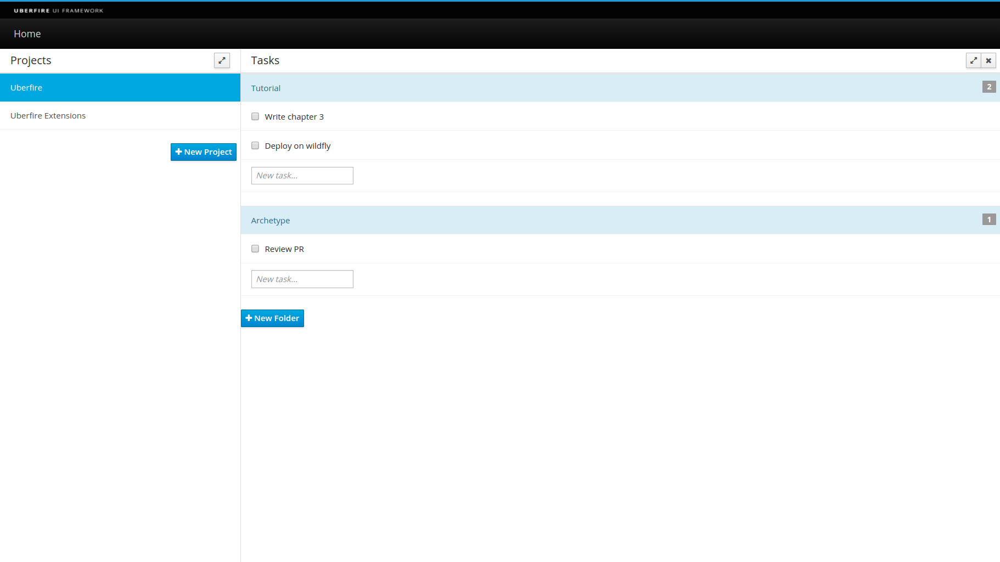
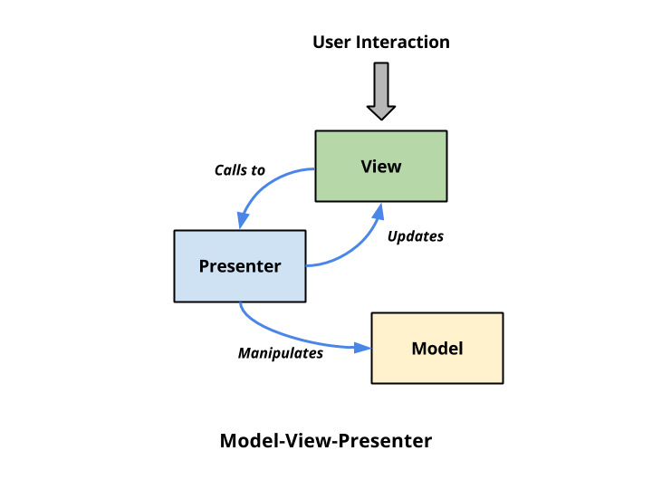

#Tutorial 1: Screens, Perspectives, Popups and Dashboards

In this tutorial, we will walk you through the process of setting up a new UberFire application we will call "UFTasks". Starting from an empty directory, we will create a simple TOD-DO list or "Task Manager". In the process we will explain most of the Uberfire components and concepts required to build a moderately complex application.

When we're done, we will have an application that looks something like this:

The left panel contains the Projects screen which contains a list of projects to be worked on. The "New Project" button is used to create new Project items.

The main panel contains the Tasks screen which lists all of the TO-DO list items for the currently selected Project. Tasks are grouped by topics, which we call "Folders" (the "Tutorial" and "Archetype" headings); they have a name and checkbox to indicate that they have been completed. The "New Folder" button is used to create new topics or Folders. New Tasks are created by simply entering a Task description in the text field and pressing the ENTER key.

## Prerequisites
This guide assumes you have the following software set up and working on your computer:

* A Java Development Kit (JDK) version 6 or newer
* Maven 3.x
* IntelliJ IDEA or Eclipse IDE for Java EE Developers

##Uberfire Design Guidelines

Before starting to write code, it's important to familiarize yourself with the [MVP Pattern](https://en.wikipedia.org/wiki/Model%E2%80%93view%E2%80%93presenter) to better understand this tutorial.

###MVP Pattern
MVP (Model-View-Presenter) like any pattern is open to interpretation, so here is how MVP is used in this tutorial:

- Model is a POJO ("Plain Old Java Object")
- View is a passive interface that presents information from the model to the user through the UI. Model data must be translated to primitive types and regular platform objects (e.g. String) so it can be displayed by the UI widgets. User actions are routed to the presenter.
- Presenter is where all business logic lives; it acts upon the model and the view.

##Cleaning the Archetype
The Uberfire Archetype contains some useful code samples that are not necessary in our app, so let's do some cleanup first. Delete the following files:

- SharedSample.java
- HelloWorldScreen.java
- HelloWorldScreen.ui.xml
- MainPerspective.java

##Creating the Project Structure

Uberfire interfaces are made of some fundamental building blocks: Widgets, Layout Panels, Screens, Workbench Panels, Menu Bars, Tool Bars, and Perspectives. Layout Panels can contain Widgets and other Layout Panels; Perspectives contains Workbench Panels, an optional Menu Bar, and an optional Tool Bar.

Perspectives split up the screen into multiple resizeable regions, and end users can drag and drop Panels between these regions to customize their workspace.

There's more that needs to be explained here, like the client-side and server-side stuff, how *.gwt.xml is used, the maven dependencies, etc. etc.