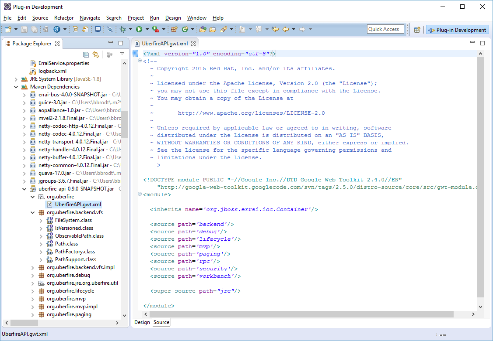

##The Uberfire VFS

Uberfire supports two types of Virtual File System (VFS) strategies: simple file access using the server host's native file system and a git-based repository file system.

Before we can talk about the server-side VFS, we need to take a little detour. A typical Uberfire project is split between server-side and client-side java code. The client code is translated from Java to Javascript by the GWT compiler. There are [lots of resources on the web](https://dzone.com/articles/understanding-gwt-compiler) that describe how all of this works, so we won't go into a lot of detail here. Suffice it to say that the *.gwt.xml files in your Uberfire project define what is client-side GWT stuff; everything else is server-side stuff. For example, have a look at the UFTasksShowcase.gwt.xml in the uftasks-webapp project:

_UFTasksShowcase.gwt.xml_
```
<?xml version="1.0" encoding="utf-8"?>
<!DOCTYPE module PUBLIC "-//Google Inc.//DTD Google Web Toolkit 2.4.0//EN"
    "http://google-web-toolkit.googlecode.com/svn/tags/2.5.0/distro-source/core/src/gwt-module.dtd">
<module>
  <inherits name="org.uberfire.UberfireAPI"/>
  <inherits name="org.uberfire.UberfireClientAPI"/>
  <inherits name="org.uberfire.UberfireWorkbench"/>
  <inherits name="org.uberfire.UberfireJS"/>
  <inherits name="org.uberfire.UberfireBackend"/>
  <inherits name="org.uberfire.UberfireWorkbenchBackend"/>
 
  <inherits name="org.uberfire.client.views.PatternFly"/>
 
  <inherits name="org.uberfire.component.UFTasksComponentClient"/>
  <!-- Specify the paths for translatable code -->
  <source path='client'/>
  <source path='shared'/>
 
</module>
```

This file lives in the "org.uberfire" package in your src/main/resources project folder and defines a GWT "module". The &lt;source path='client'&gt; and &lt;source path='shared'&gt; elements declare that all the classes in the org.uberfire.client and org.uberfire.shared packages and their sub-packages are GWT-managed. Everything else (e.g. the stuff in the org.uberfire.backend package) is server-side.

The &lt;inherits&gt; elements define the dependencies required by this module. Java source code for these dependencies must be available to the GWT compiler, and must have their own *.gwt.xml resources, i.e. they must also be GWT modules. For example, if you're using the eclipse IDE to build your Uberfire project, you can see these in the "Maven Dependencies" library:



As you may have guessed, objects that are **@Inject**ed into code must be **@Produced** from somewhere. In the case of the VFS, an I/O service instance is produced by a server-side class, named ApplicationScopedProducer in our uftasks-webapp project. The class looks like this:

_ApplicationScopedProducer.java_
```
import javax.annotation.PostConstruct;
import javax.enterprise.context.ApplicationScoped;
import javax.enterprise.inject.Produces;
import javax.inject.Inject;
import javax.inject.Named;
 
import org.uberfire.commons.services.cdi.Startup;
import org.uberfire.commons.services.cdi.StartupType;
import org.uberfire.io.IOService;
import org.uberfire.io.impl.IOServiceNio2WrapperImpl;
 
@Startup(StartupType.BOOTSTRAP)
@ApplicationScoped
public class ApplicationScopedProducer {
 
    @Inject
    private IOWatchServiceAllImpl watchService;
 
    private IOService ioService;
 
    @PostConstruct
    public void setup() {
        ioService  = new IOServiceNio2WrapperImpl("1", watchService);
    }
 
    @Produces
    @Named("ioStrategy")
    public IOService ioService() {
        return ioService;
    }
 
}
```

This class instantiates a default VFS service implementation (an **IOServiceNio2WrapperImpl**) which in this case is a git-based repository, and makes the service available to other application beans. Note the optional use of the **@Inject**ed IOWatchServiceAllImpl object. Your application beans can listen for VFS resource changes by **@Observe**ing the events broadcast from this service.

Also notice the **@Startup(StartupType.BOOTSTRAP)** annotation. This guarantees that this bean will be processed during the container's startup sequence and before any other beans. In other words, the **ioService** will be made available very early on during the app server's lifecycle. Note that this does not "create" a file system interface yet; that is where the next class comes in:

_AppSetup.java_

```
package org.uberfire.backend.server;
 
import java.net.URI;
import java.util.HashMap;
 
import javax.annotation.PostConstruct;
import javax.enterprise.context.ApplicationScoped;
import javax.inject.Inject;
import javax.inject.Named;
 
import org.uberfire.commons.services.cdi.Startup;
import org.uberfire.io.IOService;
import org.uberfire.java.nio.file.FileSystemAlreadyExistsException;
 
@ApplicationScoped
@Startup
public class AppSetup {
 
    @Inject
    @Named("ioStrategy")
    private IOService ioService;
 
    @PostConstruct
    public void init() {
        try {
            ioService.newFileSystem( URI.create("default://uftasks"),  new HashMap<String, Object>() {} );
             
        } catch ( final FileSystemAlreadyExistsException ignore ) {
 
        }
    }
 
}
```

The **AppSetup** class uses the **ioService** object to create the default file system. This bean is also processed during server startup, but only after all of the other BOOTSTRAP beans have been processed. This file system is registered with the Uberfire **VFSService**, and that is how the client code interacts with the server-side file system.

###VFS File Reading and Writing

Here's a very simple example of client-side code that reads from a VFS file on the server:

```
@Inject
protected Caller<VFSService> vfsServices;
 
private void readFile(String fileURI) {
    vfsServices.call(new RemoteCallback<Path>() {
        @Override
        public void callback(final Path path) {
            vfsServices.call(new RemoteCallback<String>() {
                @Override
                public void callback(final String response) {
                    GWT.log("Read Response: " + response);
                }
            }).readAllString(path);
        }
    }).get(fileURI);
}
```

Here, the outer **vfsServices.call()** returns a **Path** object by way of the **callback()** method; the inner **call()** does the actual file reading from the **Path** object and its **callback()** returns the file contents as a **String**.

Notice that, because this is an interaction between the client and server, everything is done asynchronously; that is, the **vfsServices.call()** returns immediately and then, at some point in the future, the server returns its response by way of the **callback()** method. It's up to your client code to gracefully handle timeouts while waiting for the server to respond.

There is another way of constructing the **Path** object without having to go through the **vfsServices.call()**, and that is to use the **PathFactory**:

```
private final static String DEFAULT_URI = "default://uftasks";
String filename = "tasks.json";
String uri = DEFAULT_URI + "/" + "/" + filename;
Path path = PathFactory.newPath(filename, uri);
```

and then the file read simply becomes:

```
vfsServices.call(new RemoteCallback<Path>() {
    @Override
    public void callback(final Path response) {
        GWT.log("Read Response: " + response);
   }
}).readAllString(path);
```

File writing is similar in structure: 

```
@Inject
protected Caller<VFSService> vfsServices;
 
private void writeFile(String fileURI, final String content) {
    String filename = "tasks.json";
    String uri = DEFAULT_URI + "/" + "/" + filename;
    Path path = PathFactory.newPath(filename, uri);
    vfsServices.call(new RemoteCallback<Path>() {
        @Override
        public void callback(final Path response) {
            GWT.log("Write Response: " + response);
        }
    }).write(path, content);
}
```

###VFS Root Location

By default, the VFS root is in a directory called ".niogit" and is created in the directory from which the web server is started, i.e. whatever the "current directory" is when you run the server startup script.

Assume that we have installed a wildfly server instance in /usr/share/wildfly. The server startup scripts are in the "bin" directory, so if we start wildfly from a shell ("command line") like so:

```
$ cd /usr/share/wildfly
$ bin/standalone.sh
```

the VFS root will be in /usr/share/wildfly/.niogit and our GIT VFS directory will be /usr/share/wildfly/.niogit/uftasks.git. The name of the GIT repository comes from the URI provided to the **ioService.newFileSystem()** call in **AppSetup**.

Note that this GIT directory is in a "detached head" state. To actually see the files in the working tree we can simply clone the repository, like so:

```
$ cd /usr/share/wildfly/.niogit
$ git clone uftasks.git
Cloning into 'uftasks'...
done.
```

This will clone uftasks.git into the directory uftasks, which can then be treated as a normal git repository. Remember to "git pull" in this repository whenever you want to get the latest updates from the VFS. If you make changes to files in this repository, they can be committed and pushed back upstream to the Uberfire VFS.

###Relocating VFS Root

Sometimes it's useful to change the VFS root so that it points to some other directory, or some other drive. This can be done by setting a system property in the server's configuration. See [App Server Configuration](https://docs.jboss.org/jbpm/v6.0/userguide/wb.Workbench.html#wb.systemProperties) for more information about how this is done. Essentially, it involves editing an app server configuration file and setting the server property "org.uberfire.nio.git.dir" to point to VFS root.

During development/testing you can also change the VFS root by adding a Java VM argument to the maven pom. Locate the pom.xml file in the uftasks-webapp project and add the following to the &lt;extraJvmArgs&gt; element:

```
<build>
  ...
  <plugins>
    <plugin>
      <groupId>org.codehaus.mojo</groupId>
      <artifactId>gwt-maven-plugin</artifactId>
      <configuration>
        <extraJvmArgs>-Dorg.uberfire.nio.git.dir=/var/tmp -Xmx1536m -XX:CompileThreshold=7000 -Derrai.jboss.home=${errai.jboss.home}</extraJvmArgs>

```

This will relocate the VFS root to /var/tmp/.niogit.
