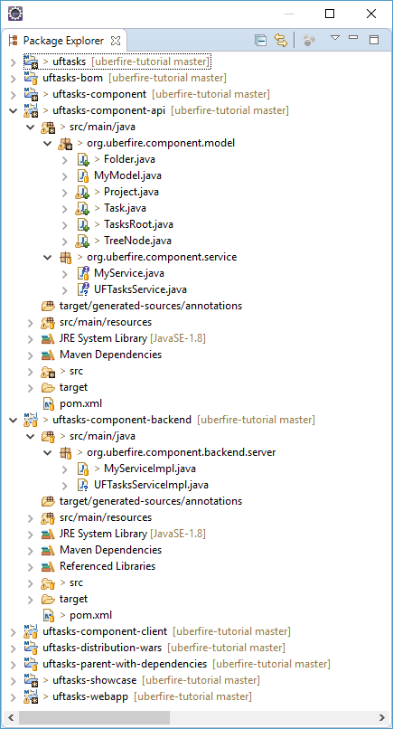

##Uberfire Services

Uberfire provides a very easy to use [RPC (Remote Procedure Call)](https://docs.jboss.org/author/display/ERRAI/Remote+Procedure+Calls+%28RPC%29) layer for implementing services that can be called from either the client or server side. This requires three components:

- a service interface definition
- a service implementation
- if model objects will be passed to/from the service, they need to be annotated with **@Portable**

In this part of the tutorial we will be building an Uberfire Service called UFTasksService, which will load and save our UFTasks model hierarchy. The actual file format will be JSON because Errai already provides marshallers that can serialize POJOs to and from this format.

Our application requires a user login, so we will be using the Errai Security module to get the user's login information and use it to create an individualized Tasks list for each user.

###Reorganizing the UFTasks Project

Before we can start building our new service, we will need to reorganize our UFTasks project a bit. recall that a web application consists of both server and client-side code. In order to implement server-side services, all of the code must be in the server (or "backend") project. 
This means we will have to move our model files (_TasksRoot.java_, _Project.java_, etc.) into the uftasks backend projects; here is what the new project structure looks like:



The uftasks-component-api project now contains our model files; this project is a dependency of the uftasks-webapp project (the client-side code) so these classes can still be resolved in our client-side code. Our new UFTasksService implementation code will be "hidden" in the uftasks-component-backen project. Now let's get started...

###Service Interface

The service interface definition is very simple - it just requires a **@Remote** annotation:

_UFTasksService.java_
```
import org.jboss.errai.bus.server.annotations.Remote;
import org.uberfire.component.model.TasksRoot;
 
@Remote
public interface UFTasksService {
    TasksRoot load(String userId);
    String save(TasksRoot tasksRoot, String userId);
}
```

Here we have defined two methods, load and save - their purpose should be obious. Note that since this service will be passing a TasksRoot model object back and forth, the TasksRoot class must be annotated with **@Portable** (see below).

###Service Implementation

This is our implementation class for the service. Note that Errai already provides a JSON marshalling class!

_UFTasksServiceImpl.java_
```
import javax.enterprise.context.ApplicationScoped;
import javax.inject.Inject;
 
import org.jboss.errai.bus.server.annotations.Service;
import org.jboss.errai.marshalling.client.Marshalling;
import org.uberfire.backend.vfs.Path;
import org.uberfire.backend.vfs.PathFactory;
import org.uberfire.backend.vfs.VFSService;
import org.uberfire.component.model.TasksRoot;
import org.uberfire.component.service.UFTasksService;
 
@Service
@ApplicationScoped
public class UFTasksServiceImpl implements UFTasksService {
    private final static String FILENAME = "tasks.json";
    private final static String DEFAULT_URI = "default://uftasks";
 
    @Inject
    protected VFSService vfsServices;
 
    @Override
    public TasksRoot load(String userId) {
        String uri = DEFAULT_URI + "/" + userId + "/" + FILENAME;
        Path path = PathFactory.newPath(FILENAME, uri);
 
        String content = vfsServices.readAllString(path);
        TasksRoot tasksRoot = Marshalling.fromJSON(content, TasksRoot.class);
        return tasksRoot;
    }
 
    @Override
    public String save(TasksRoot tasksRoot, String userId) {
        String content = Marshalling.toJSON(tasksRoot);
        String uri = DEFAULT_URI + "/" + userId + "/" + FILENAME;
        Path path = PathFactory.newPath(FILENAME, uri);
 
        path = vfsServices.write(path, content);
        if (path!=null)
            return path.getFileName();
        return null;
    }
}
```

Since this service is being executed on the server side, the **VFSService** is a "peer" and can be called directly instead of having to use a **Callback**. Recall that, on the client side the client had to invoke **VFSService** asynchronously because information was sent over the wire from client to server and then back to client.

###Model Object Changes

Finally, our model objects need to be annotated with **@Portable**. This tells Errai that the object will need to be serialized so that it can be sent over the wire between client and server. For example:

_Task.java_

```
package org.uberfire.shared.model;

@Portable
public class Task extends TreeNode<Folder, TreeNode> {
    private String name;
    private boolean done;
 
    public Task(@MapsTo("name") String name) {
        this.name = name;
        this.done = false;
    }
}
```

Notice the **@MapsTo** annotation in the constructor. This tells Errai that this parameterized constructor accepts the initial value for the **name** attribute.

Errai uses Java reflection to traverse the object's class definition. This means that any class fields that are not primitive types, or simple java List types must also be annotated as **@Portable**. 
Although we don't show these changes here, all of our other model objects, **TreeNode**, **TasksRoot**, **Project**, **Folder** and **Task**, will require the **@Portable** annotation as well.

###Client-side Changes

Now that we have our UFTasks service, we can use it on the client-side. Recall that the **ProjectsPresenter** was the "owner" of the **TasksRoot** object - our model root. The reason for doing this, and sending all model changes to this class should now become clear: whenever a model change occurs, **ProjectsPresenter** will be responsible for serializing those changes using our **UFTasksService**.

Here is the new version of this class:

_ProjectsPresenter.java_
```
package org.uberfire.client.screens;

import javax.annotation.PostConstruct;
import javax.enterprise.context.ApplicationScoped;
import javax.enterprise.event.Event;
import javax.enterprise.event.Observes;
import javax.enterprise.inject.Produces;
import javax.inject.Inject;
import javax.inject.Named;

import org.jboss.errai.common.client.api.Caller;
import org.jboss.errai.common.client.api.RemoteCallback;
import org.jboss.errai.security.shared.api.identity.User;
import org.uberfire.client.annotations.WorkbenchPartTitle;
import org.uberfire.client.annotations.WorkbenchPartView;
import org.uberfire.client.annotations.WorkbenchScreen;
import org.uberfire.client.mvp.UberView;
import org.uberfire.client.screens.popup.NewProjectPresenter;
import org.uberfire.component.model.Folder;
import org.uberfire.component.model.Project;
import org.uberfire.component.model.Task;
import org.uberfire.component.model.TasksRoot;
import org.uberfire.component.service.UFTasksService;
import org.uberfire.shared.events.FolderCreatedEvent;
import org.uberfire.shared.events.FolderRemovedEvent;
import org.uberfire.shared.events.ProjectSelectedEvent;
import org.uberfire.shared.events.TaskChangedEvent;
import org.uberfire.shared.events.TaskCreatedEvent;
import org.uberfire.shared.events.TaskDoneEvent;

import com.google.gwt.core.client.GWT;

@ApplicationScoped
@WorkbenchScreen(identifier = "ProjectsPresenter")
public class ProjectsPresenter {

    public interface View extends UberView<ProjectsPresenter> {

        void clearProjects();

        void addProject(Project project, boolean selected);
    }

    @Inject
    private View view;

    @Inject
    private NewProjectPresenter newProjectPresenter;

    @Inject
    private Event<ProjectSelectedEvent> projectSelectedEvent;

    @Inject
    private User user;

    @Inject
    Caller<UFTasksService> ufTasksService;
    
    private TasksRoot tasksRoot = new TasksRoot();

    private Project activeProject = null;
    
    @WorkbenchPartTitle
    public String getTitle() {
        return "Projects";
    }

    @WorkbenchPartView
    public UberView<ProjectsPresenter> getView() {
        return view;
    }

    @Produces
    @Named("tasksRoot")
    public TasksRoot tasksRoot() {
        return tasksRoot;
    }

    @PostConstruct
    public void init() {
        loadTasksRoot();
    }

    private void loadTasksRoot() {
        ufTasksService.call(new RemoteCallback<TasksRoot>() {
            @Override
            public void callback(final TasksRoot response) {
                if (response!=null)
                    tasksRoot = response;
                else 
                    GWT.log("UFTasksService is unable to load tasks file");
                updateView();
            }
        }).load(user.getIdentifier());
    }
    
    private void saveTasksRoot() {
        ufTasksService.call(new RemoteCallback<String>() {
            @Override
            public void callback(final String response) {
                GWT.log("Write Response: " + response);
            }
        }).save(tasksRoot, user.getIdentifier());
    }
    
    public void taskCreated(@Observes TaskCreatedEvent taskCreated) {
        if (activeProject!=null) {
            Folder folder = taskCreated.getFolder();
            Task task = taskCreated.getTask();
            folder.addChild(task);
            saveTasksRoot();
            updateView();
        }
    }

    public void taskDone(@Observes TaskDoneEvent taskDone) {
        Task task = taskDone.getTask();
        task.setDone(true);
        saveTasksRoot();
        updateView();
    }

    public void folderCreated(@Observes FolderCreatedEvent folderCreated) {
        if (activeProject!=null) {
            activeProject.addChild(folderCreated.getFolder());
            saveTasksRoot();
            updateView();
        }
    }
    
    public void newProject() {
        newProjectPresenter.show(this);
    }

    public void createNewProject(String projectName) {
        tasksRoot.getChildren().add(new Project(projectName));
        saveTasksRoot();
        updateView();
    }

    private void updateView() {
        view.clearProjects();
        for (Project project : tasksRoot.getChildren()) {
            view.addProject(project, project.isSelected());
        }
    }

    public void selectProject(Project project) {
        setActiveProject(project);
        projectSelectedEvent.fire(new ProjectSelectedEvent(project));
    }

    private void setActiveProject(Project project) {
        activeProject = project;
        for (Project p : tasksRoot.getChildren()) {
            if (p == project) {
                p.setSelected(true);
            }
            else {
                p.setSelected(false);
            }
        }
        updateView();
    }
}
```

There are quite a few changes here that deserve some explanation:

- The **@Inject**ed **User** object contains the currently logged-in user information. We will use this to determine where to persist this user's Tasks list.
- The method **loadTasksRoot()** is now called immediately after the **ProjectsPresenter** class is constructed (see the **@PostConstruct** annotation.) This method is responsible for invoking our new UFTasksService and updating the **ProjectsView** when the service returns.
- The method **saveTasksRoot()** is responsible for calling the UFTasksService to save the model in the user's file area. The full file path will consist of the VFS root (/uftasks) followed by the user ID and the file name "tasks.json"; for example: /uftasks/admin/tasks.json.
- All model changes from **@Observes** events and **createNewProject()** now call **saveTasksRoot()** to persist the changes.

###A Closer Look at Errai Marshalling

After rebuilding and running the application, create some Projects, Folders and Tasks, then take a look at the "tasks.json" file; remember to navigate to your cloned GIT repository and do a "git pull" to get the latest changes. You should see something similar to this:

```
{
    "^EncodedType": "org.uberfire.component.model.TasksRoot",
    "^ObjectID": "1",
    "parent": null,
    "children": {
        "^EncodedType": "java.util.ArrayList",
        "^ObjectID": "2",
        "^Value": [
            {
                "^EncodedType": "org.uberfire.component.model.Project",
                "^ObjectID": "3",
                "name": "House Chores",
                "selected": true,
                "parent": null,
                "children": {
                    "^EncodedType": "java.util.ArrayList",
                    "^ObjectID": "4",
                    "^Value": [
                        {
                            "^EncodedType": "org.uberfire.component.model.Folder",
                            "^ObjectID": "5",
                            "name": "Honey-do list",
                            "parent": {
                                "^EncodedType": "org.uberfire.component.model.Project",
                                "^ObjectID": "3"
                            },
                            "children": {
                                "^EncodedType": "java.util.ArrayList",
                                "^ObjectID": "6",
                                "^Value": [
                                    {
                                        "^EncodedType": "org.uberfire.component.model.Task",
                                        "^ObjectID": "7",
                                        "name": "Fix the leaky gutters",
                                        "done": false,
                                        "priority": 0,
                                        "dueDate": {
                                            "^EncodedType": "java.util.Date",
                                            "^ObjectID": "-1125032746",
                                            "^Value": "1467753782659"
                                        },
                                        "id": "1467753782659",
                                        "parent": {
                                            "^EncodedType": "org.uberfire.component.model.Folder",
                                            "^ObjectID": "5"
                                        },
                                        "children": {
                                            "^EncodedType": "java.util.ArrayList",
                                            "^ObjectID": "8",
                                            "^Value": []
                                        }
                                    },
                                    {
                                        "^EncodedType": "org.uberfire.component.model.Task",
                                        "^ObjectID": "9",
                                        "name": "Walk the dog",
                                        "done": false,
                                        "priority": 0,
                                        "dueDate": {
                                            "^EncodedType": "java.util.Date",
                                            "^ObjectID": "-1125027343",
                                            "^Value": "1467753787556"
                                        },
                                        "id": "1467753787556",
                                        "parent": {
                                            "^EncodedType": "org.uberfire.component.model.Folder",
                                            "^ObjectID": "5"
                                        },
                                        "children": {
                                            "^EncodedType": "java.util.ArrayList",
                                            "^ObjectID": "10",
                                            "^Value": []
                                        }
                                    },
                                    {
                                        "^EncodedType": "org.uberfire.component.model.Task",
                                        "^ObjectID": "11",
                                        "name": "Mow the lawn",
                                        "done": true,
                                        "priority": 0,
                                        "dueDate": {
                                            "^EncodedType": "java.util.Date",
                                            "^ObjectID": "-1125021191",
                                            "^Value": "1467753793708"
                                        },
                                        "id": "1467753793708",
                                        "parent": {
                                            "^EncodedType": "org.uberfire.component.model.Folder",
                                            "^ObjectID": "5"
                                        },
                                        "children": {
                                            "^EncodedType": "java.util.ArrayList",
                                            "^ObjectID": "12",
                                            "^Value": []
                                        }
                                    }
                                ]
                            }
                        }
                    ]
                }
            }
        ]
    }
}

```

Notice that Errai inserts a bunch of metadata into the JSON. This is required so that the marshaller knows exactly how to reconstruct the model when parsing this JSON.