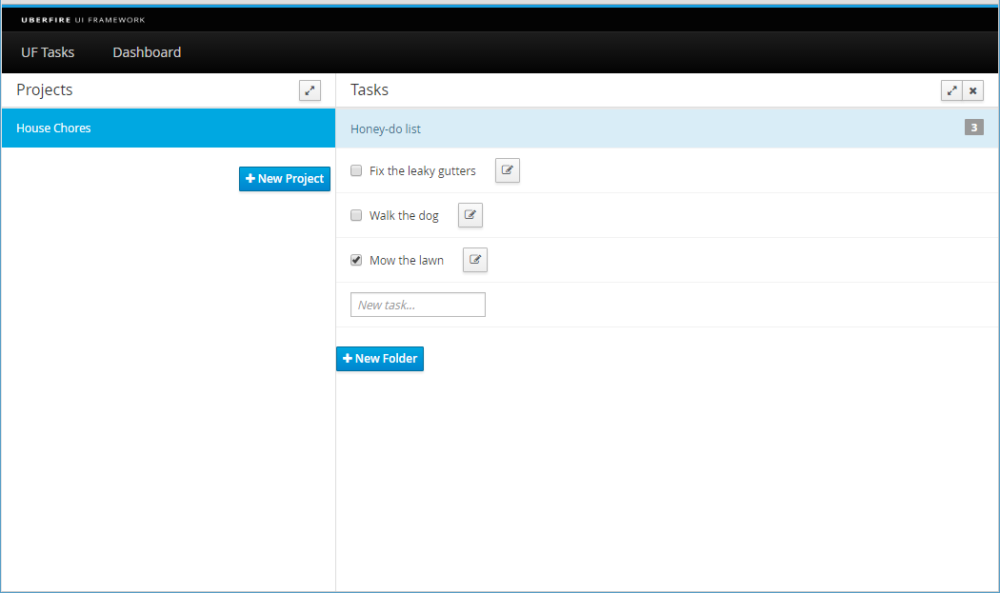

###New Task Popup

Let's start by duplicating the _NewFolderPresenter.java_ and _NewFolderView.java_ in the org.uberfire.client.screens.popup package for our New Task Popup classes:

_NewTaskPresenter.java_

```
package org.uberfire.client.screens.popup;

import javax.annotation.PostConstruct;
import javax.enterprise.context.Dependent;
import javax.inject.Inject;

import org.uberfire.client.mvp.UberView;
import org.uberfire.client.screens.TasksPresenter;

@Dependent
public class NewTaskPresenter {
 
    public interface View extends UberView<NewTaskPresenter> {
 
        void show();
 
        void hide();
    }
 
    @Inject
    private View view;
 
    private TasksPresenter tasksPresenter;
 
    @PostConstruct
    public void setup() {
        view.init( this );
    }
 
    public void show( TasksPresenter tasksPresenter, Task task ) {
        this.tasksPresenter = tasksPresenter;
        view.show(task);
    }
 
    public void close() {
        view.hide();
    }
}
```

_NewTaskView.java_
```
@Dependent
@Templated
public class NewTaskView extends Composite
        implements NewTaskPresenter.View {
     
    private NewTaskPresenter presenter;
 
    private Modal modal;
    
	private Task task;
	
    @Inject
    @DataField("ok-button")
    Button okButton;
 
    @Inject
    @DataField("cancel-button")
    Button cancelButton;
 
    @Override
    public void init( NewTaskPresenter presenter ) {
        this.presenter = presenter;
 
        this.modal = new Modal();
        final ModalBody body = new ModalBody();
        body.add( this );
        modal.add( body );
    }
 
    @Override
    public void show(Task task) {
		this.task = task;
        modal.show();
    }
 
    @Override
    public void hide() {
        modal.hide();
    }
 
    @EventHandler("ok-button")
    public void onOk( ClickEvent event ) {
        presenter.close();
    }
 
    @EventHandler("cancel-button")
    public void onCancel( ClickEvent event ) {
        presenter.close();
    }
}
```

We will also need an HTML template for this Screen:

_NewTaskView.html_

```
<div>
     <form data-field="task-editor-modal">
        <fieldset>
            <legend>Task Editor</legend>
            <div class="form-group">
            </div>
        </fieldset>
    </form>
    <div class="modal-footer">
        <button type="button" class="btn btn-danger" data-field="cancel-button">Cancel</button>
        <button type="button" class="btn btn-primary" data-field="ok-button">OK</button>
    </div>
</div>
```

Our new Popup will be invoked from the Tasks Screen when a button is pressed. We'll now add this new button to our **TasksView** and a handler for it in **TasksPresenter**:

Add this method to our Presenter class:

_TasksPresenter.java_
```
import org.uberfire.client.screens.popup.NewTaskPresenter;

[...]

    @Inject
    private NewTaskPresenter newTaskPresenter;
 
    public void showTaskEditor(Task task) {
        newTaskPresenter.show(this, task);
    }
```

In _TasksView.java_ change the **generateTasks()** method and add the following code: 

_TasksView.java_
```
import org.gwtbootstrap3.client.ui.constants.IconType;


[...]

    private ListGroupItem generateTask(Task task) {
        TaskItem taskItem = new TaskItem(task);
        taskItem.add(createTaskCheckbox(task));
        taskItem.add(createTaskNotesButton(task));

        return taskItem;
    }
	
    private Button createTaskNotesButton(Task task) {
        Button button = GWT.create(Button.class);
        button.setIcon(IconType.EDIT);
        button.setMarginLeft(20.0);
        button.addClickHandler(event -> presenter.showTaskEditor(task));
        return button;
    }
```

This will append a button with an EDIT icon to the name in the task list.

###Time to see it work!

Rebuild the application and run it; you should see this:



When you click one of the buttons next to the Task name, you will get an empty Popup dialog with an OK and Cancel buttons.

###Adding the Widgets

Now let's flesh out the New Task View by adding some widgets for our new **priority** and **dueDate** attributes.
Add the following code to the view classes:

_NewTaskView.java_
```
import org.gwtbootstrap3.client.ui.Anchor;
import com.google.gwt.user.client.ui.Label;
import com.google.gwt.user.client.ui.ListBox;
import com.google.gwt.user.client.ui.RichTextArea;
import com.google.gwt.user.datepicker.client.DatePicker;

[...]
    
    RichTextArea notesTextArea;
   
    ListBox priorityListBox;
    
    DatePicker dueDatePicker;
    
    @Inject
    @DataField("task-notes")
    Anchor taskNotesAnchor;
    
    @Inject
    @DataField("task-priority")
    Anchor taskPriorityAnchor;
    
    @Inject
    @DataField("task-due-date")
    Anchor taskDueDateAnchor;

    @Inject
    @DataField("task-due-date-label")
    Label dueDateLabel;

    @Override
    public void init( TaskEditorPresenter presenter ) {
        this.presenter = presenter;

        this.modal = new Modal();
        final ModalBody body = new ModalBody();
        body.add( this );
        modal.add( body );
        
        // add the other widgets
        notesTextArea = new RichTextArea(); 
        notesTextArea.setHeight("200");
        notesTextArea.setWidth("100%");
        taskNotesAnchor.add(notesTextArea);
        
        priorityListBox = new ListBox();
        priorityListBox.setMultipleSelect(false);
        priorityListBox.addItem("Medium", "2");
        priorityListBox.addItem("High", "3");
        priorityListBox.addItem("Low", "1");
        priorityListBox.addItem("Screw it, I don't time for this crap!", "0");
        taskPriorityAnchor.add(priorityListBox);
        
        dueDatePicker = new DatePicker();
        dueDatePicker.setYearArrowsVisible(true);
        dueDatePicker.setYearAndMonthDropdownVisible(true);
        dueDatePicker.setVisibleYearCount(51);
        dueDatePicker.addValueChangeHandler(new DueDateValueChangeHandler(dueDateLabel));
        dueDatePicker.setValue(new Date(), true);
        taskDueDateAnchor.add(dueDatePicker);
    }
	
    @Override
    public void show(Task task) {
		this.task = task;
        notesTextArea.setHTML(task.getNotes());
        for (int index=0; index<priorityListBox.getItemCount(); ++index) {
            int v = Integer.parseInt(priorityListBox.getValue(index));
            if (v == task.getPriority()) {
                priorityListBox.setSelectedIndex(index);
                break;
            }
        }
        dueDatePicker.setValue(task.getDueDate(), true);
        dueDatePicker.setCurrentMonth(task.getDueDate());
        modal.show();
    }
```

_NewTaskView.html_
```
<div>
     <form data-field="task-editor-modal">
        <fieldset>
            <legend>Task Editor</legend>
            <div class="form-group">
                <a data-field="task-notes"></a>
               	<br/>
               	<b>Due Date:</b> <label data-field="task-due-date-label">Due Date</label> <a data-field="task-due-date"></a>
                <br/>
                <b>Priority:</b> <a data-field="task-priority"></a>
            </div>
        </fieldset>
    </form>
    <div class="modal-footer">
        <button type="button" class="btn btn-danger" data-field="cancel-button">Cancel</button>
        <button type="button" class="btn btn-primary" data-field="ok-button">OK</button>
    </div>
</div>
```

This completes the user interface requirements, but now we still need to get the Task change information back to our **ProjectsPresenter** so that the changes can be persisted. To do this, we will use an Event notification mechanism like we have already seen with **ProjectSelectedEvent** and **FolderCreatedEvent**.

Let's create a new notification class in the org.uberfire.shared.events package:

_TaskChangedEvent.java_
```
package org.uberfire.shared.events;

import org.uberfire.component.model.Task;

public class TaskChangedEvent {

    Task task;
    
    public TaskChangedEvent(Task task) {
        this.task = task;
    }
    
    public Task getTask() {
        return task;
    }
}
```

Then change the "OK" button click handler to fire the event:

_NewTaskView.java_
```
import org.uberfire.shared.events.TaskChangedEvent;

[...]

    @Inject
    private Event<TaskChangedEvent> taskChangedEvent;

    @EventHandler("ok-button")
    public void onOk( ClickEvent event ) {
		taskChangedEvent.fire(new TaskChangedEvent(this.task));
        presenter.close();
    }
```

Finally, we need to listen for this event in **ProjectsPresenter**. Add the following code:

_ProjectsPresenter.java_
```
import org.uberfire.shared.events.TaskChangedEvent;

[...]

    public void taskChanged(@Observes TaskChangedEvent taskChanged) {
        Task changedTask = taskChanged.getTask();
        Task task = tasksRoot.getTask(changedTask.getId());
        if (task!=null) {
            task.set(changedTask);
        }
        saveTasksRoot();
        updateView();
    }
```

###Time to see it work!

Rebuild the application and run it; you should see this when you click on the Edit button in the Task list:
