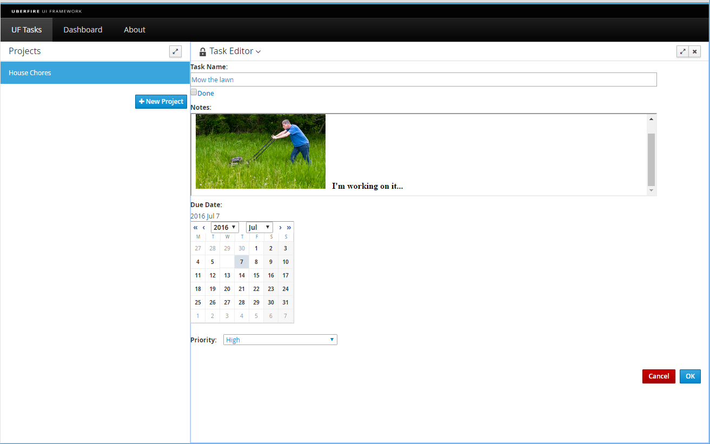

###The View

Surprisingly, the Task editor view has not changed very much from its previous incarnation that was hosted in a Popup dialog box. Let's create a copy of the **NewTaskView** class in the org.uberfire.client.editors package and make the necessary changes:

_TaskEditorView.java_
```
package org.uberfire.client.editors;

import java.util.Date;

import javax.enterprise.context.Dependent;
import javax.inject.Inject;

import org.gwtbootstrap3.client.ui.Anchor;
import org.gwtbootstrap3.client.ui.Button;
import org.jboss.errai.ui.shared.api.annotations.DataField;
import org.jboss.errai.ui.shared.api.annotations.EventHandler;
import org.jboss.errai.ui.shared.api.annotations.Templated;
import org.uberfire.component.model.TaskWithNotes;
import org.uberfire.ext.editor.commons.client.EditorTitle;
import org.uberfire.ext.editor.commons.client.resources.i18n.CommonConstants;

import com.google.gwt.event.dom.client.ClickEvent;
import com.google.gwt.event.logical.shared.ValueChangeEvent;
import com.google.gwt.event.logical.shared.ValueChangeHandler;
import com.google.gwt.i18n.client.DateTimeFormat;
import com.google.gwt.i18n.client.DateTimeFormat.PredefinedFormat;
import com.google.gwt.user.client.Window;
import com.google.gwt.user.client.ui.CheckBox;
import com.google.gwt.user.client.ui.Composite;
import com.google.gwt.user.client.ui.Label;
import com.google.gwt.user.client.ui.ListBox;
import com.google.gwt.user.client.ui.RichTextArea;
import com.google.gwt.user.client.ui.TextBox;
import com.google.gwt.user.datepicker.client.DatePicker;

@Dependent
@Templated
public class TaskEditorView extends Composite implements TaskEditorPresenter.View {
    
    public static class DueDateValueChangeHandler implements ValueChangeHandler<Date> {
        private final Label text;

        public DueDateValueChangeHandler(Label text) {
            this.text = text;
        }

        public void onValueChange(ValueChangeEvent<Date> event) {
            Date date = event.getValue();
            String dateString = DateTimeFormat.getFormat(PredefinedFormat.DATE_MEDIUM).format(date);
            text.setText(dateString);
        }
    }

    private TaskEditorPresenter presenter;

    private TaskWithNotes taskWithNotes;
    
    protected EditorTitle title = new EditorTitle();

    TextBox nameTextBox;
    
    CheckBox doneCheckBox;
    
    RichTextArea notesTextArea;
   
    ListBox priorityListBox;
    
    DatePicker dueDatePicker;
    
    @Inject
    @DataField("task-name")
    Anchor taskNameAnchor;
    
    @Inject
    @DataField("task-done")
    Anchor taskDoneAnchor;
    
    @Inject
    @DataField("task-notes")
    Anchor taskNotesAnchor;
    
    @Inject
    @DataField("task-priority")
    Anchor taskPriorityAnchor;
    
    @Inject
    @DataField("task-due-date")
    Anchor taskDueDateAnchor;

    @Inject
    @DataField("task-due-date-label")
    Label dueDateLabel;
    
    @Inject
    @DataField("ok-button")
    Button okButton;

    @Inject
    @DataField("cancel-button")
    Button cancelButton;
            
    @Override
    public void init( TaskEditorPresenter presenter ) {
        this.presenter = presenter;
        
        nameTextBox = new TextBox();
        nameTextBox.setWidth("90%");
        taskNameAnchor.add(nameTextBox);
        
        doneCheckBox = new CheckBox();
        doneCheckBox.setText("Done");
        taskDoneAnchor.add(doneCheckBox);
        
        notesTextArea = new RichTextArea(); 
        notesTextArea.setHeight("200");
        notesTextArea.setWidth("90%");
        taskNotesAnchor.add(notesTextArea);
        
        priorityListBox = new ListBox();
        priorityListBox.setMultipleSelect(false);
        priorityListBox.addItem("Medium", "2");
        priorityListBox.addItem("High", "3");
        priorityListBox.addItem("Low", "1");
        priorityListBox.addItem("Screw it, I don't time for this crap!", "0");
        taskPriorityAnchor.add(priorityListBox);
        
        dueDatePicker = new DatePicker();
        dueDatePicker.setYearArrowsVisible(true);
        dueDatePicker.setYearAndMonthDropdownVisible(true);
        dueDatePicker.setVisibleYearCount(51);
        dueDatePicker.addValueChangeHandler(new DueDateValueChangeHandler(dueDateLabel));
        dueDatePicker.setValue(new Date(), true);
        taskDueDateAnchor.add(dueDatePicker);
    }

    @Override
    public EditorTitle getTitleWidget() {
        return title;
    }

    @EventHandler("ok-button")
    public void onOk( ClickEvent event ) {
        presenter.save();
        presenter.close();
    }

    @EventHandler("cancel-button")
    public void onCancel( ClickEvent event ) {
        if (confirmClose())
            presenter.close();
    }

    private boolean confirmClose() {
        if (isDirty()) {
            if (!Window.confirm(CommonConstants.INSTANCE.DiscardUnsavedData()))
                return false;
        }
        return true;
    }

    @Override
    public void setContent(TaskWithNotes content) {
        taskWithNotes = content;
        nameTextBox.setText(taskWithNotes.getName());
        doneCheckBox.setValue(taskWithNotes.isDone());
        notesTextArea.setHTML(taskWithNotes.getNotes());
        for (int index=0; index<priorityListBox.getItemCount(); ++index) {
            int v = Integer.parseInt(priorityListBox.getValue(index));
            if (v == taskWithNotes.getPriority()) {
                priorityListBox.setSelectedIndex(index);
                break;
            }
        }
        dueDatePicker.setValue(taskWithNotes.getDueDate(), true);
        dueDatePicker.setCurrentMonth(taskWithNotes.getDueDate());
    }

    @Override
    public TaskWithNotes getContent() {
        TaskWithNotes content = new TaskWithNotes(taskWithNotes);
        content.setName(nameTextBox.getText());
        content.setDone(doneCheckBox.getValue());
        content.setNotes(notesTextArea.getHTML());
        content.setPriority(Integer.parseInt(priorityListBox.getSelectedValue()));
        content.setDueDate(dueDatePicker.getValue());
        return content;
    }

    @Override
    public boolean isDirty() {
        // check if anything has changed
        return !getContent().equals(taskWithNotes);
    }
}
```

We have added a Rich Text Area widget to hold the task notes; the **setContent()** method is called by **TaskEditorPresenter** immediately after it has loaded the task notes from the VFS file.

When the user clicks the "OK" button, we ask **TaskEditorPresenter** to save the Task. This checks to see if anything has changed by calling the View's **getContent()** method to fetch the updated **Task** values and then fires the **TasksChangedEvent**.

###Time to see it work!

We'll need to rebuild the entire application because some backend classes have changed and need to be recompiled. Now when you click on the Edit button for a Task, you should see the WorkbenchEditor in action:

